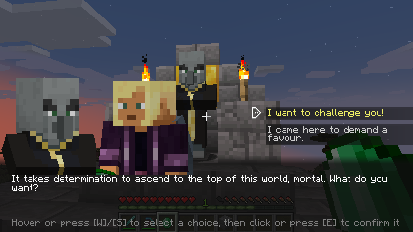
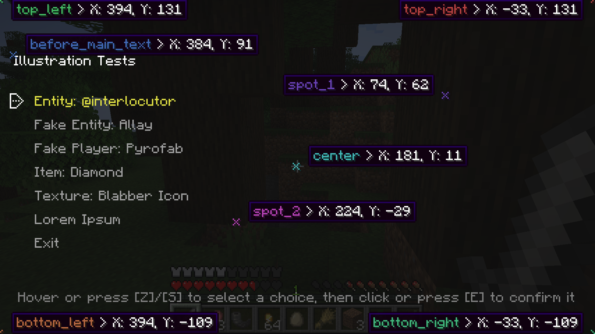

Are you a modpack maker who wants their players to talk to more than a quest book?
Are you a modded server owner who wants to sprinkle some ✨immersion✨ in their world?
Are you perhaps a modder who is looking for an easy-to-use dialogue library with expansive tooling?

Blabber is a mod and library for displaying interactive dialogues to your players.
Just write your dialogue description files, then start them on demand!

## How it looks

Like that:

{:.rounded}

Or like that:

{:.rounded}

You get to choose per-dialogue.

## How it works

### Commands

Blabber adds the `/blabber` command, allowing server operators and mapmakers to interact with the mod through commands.

- `/blabber dialogue`
    - `/blabber dialogue start <dialogue> [<targets>] [<interlocutor>]` : Starts a dialogue for one or more players.
        - `<dialogue>` : the unique identifier for the dialogue
        - `[<targets>]` (optional) : If specified, must be either a player's username or a target selector. If unspecified, defaults to the player using the command. When used in a command block, `[<targets>]` is not optional.
        - `[<interlocutor>]` (optional) : If specified, must be a target selector for a single entity. If unspecified, defaults to no interlocutor.
    - `/blabber settings set <setting> <true|false>` : Toggles a debug setting.
      - `<setting>` : the name of a [debug setting](#debug-modes) - currently, the only possible value is `debug.anchors`.

### Format

Blabber will automatically load all JSON files in the `data/[namespace]/blabber/dialogues` directory.
If you are making a mod, the `data` directory in question is in `src/resources`, next to your `fabric.mod.json` or `quilt.mod.json`.
Otherwise, if you are making a datapack, this directory is at the root, right next to your `pack.mcmeta`.

<figure>
<ul class="directory-list">
    <li class="folder"><span>data</span>
        <ul><li class="folder"><span><code>&lt;namespace&gt;</code></span>
            <ul><li class="folder"><span>blabber</span>
                <ul><li class="folder"><span>dialogues</span>
                    <ul><li><span><code>&lt;dialogue_name&gt;</code>.json</span></li></ul>
                </li></ul>
            </li></ul>
        </li></ul>
    </li>
</ul>
<figcaption>Location of a dialogue file in a datapack/mod - the resulting dialogue will be registered as <code>&lt;namespace&gt;:&lt;dialogue_name&gt;</code>.</figcaption>
</figure>

These files will also be reloaded when running `/reload`, just like tags and functions.

Each file describes the various states a dialogue can be in. Here is a super basic example:

<figure class="mediafigure">

<figcaption>State diagram for a dialogue with 2 intermediate states and 2 end states</figcaption>
</figure>

This dialogue has 5 states: `start`, `accept`, `end_success`, `refuse`, and `end_failure`.
When a player gets this dialogue, they will first be shown "Do you want potatoes?" with the options "Yes please!" and "No thanks.".

- If they click "Yes please!", they will switch to the `accept` state and be shown the text "Alright, have potatoes" with the only choice "ok".
When they click on that choice, they will switch to the `end_success` state, which ends the dialogue.

- If they click "No thanks.", they will switch to the `refuse` state and be shown the text "Are you sure?" with the choices "yes" and "I changed my mind." being available.
    - If they click on "yes", they will switch to the `end_failure` state, which also ends the dialogue. 
    - However, if they click on "I changed my mind", they will switch to the `accept` state, and be shown the same text and only choice.

Of course, this would be quite useless if we didn't give the player their potatoes.
We can fix this by adding an action to the `end_success` state; a command action with the value `/give @s potato 12` should do nicely.

Here's the JSON file corresponding to what we just described:

<h4 id="basic-dialogue-json" class="no_anchor">basic-dialogue.json</h4>

```json

```



#### Text

Texts in dialogues use the [standard minecraft text format](https://minecraft.wiki/w/Raw_JSON_text_format#Java_Edition).

A couple of things to keep in mind :

- you can write `\n` in text literals or translations to make a new line
- fancy text content like entity selectors should work as expected,
  however they are resolved only once at the start of a dialogue
  (which means if you use a "nearest entity" selector and entities around the player move,
  the selector will keep targeting the one that was closest when the dialogue started)

#### Layout

As noted in [the previous section](#how-it-looks), you can choose if your dialogue uses the classic layout, or the RPG
layout (first and second screenshot, respectively).

When using the RPG layout, be mindful of how many choices you have and how long they are. While they may fit
on the screen just fine in languages like English, they may take up too much space once translated
(this also applies to the classic layout, though to a lesser degree).
{:.admonition.admonition-important.admonition-icon}

Starting in version 1.6.0, layouts can take additional parameters to customize their render.
Currently (1.6.0), the only supported parameter is `main_text_margins` on the `blabber:rpg` layout.

The JSON looks like this (goes at the top level, replace `"blabber:classic"` with `"blabber:rpg"` for the alternative look):

<h5 id="simple-layout-json" class="no_anchor">Simple layout JSON</h5>

```json
{
  "layout": {
    "type": "blabber:classic"
  }
}
```


<h5 id="parameterized-layout-json" class="no_anchor">Parameterized layout JSON</h5>

```json
{
  "layout": {
    "type": "blabber:rpg",
    "params": {
      "main_text_margins": {
        "left": 52,
        "right": -4,
        "top": 10,
        "bottom": 5
      }
    }
  }
}
```



#### Illustrations

Starting with version 1.5.0 of Blabber, dialogues can make use of *illustrations* - graphical content that help
bring them to life 🧑‍🎨

{:.rounded.wiki}

Illustrations can be set for a regular dialogue state, or for individual choices within a state.

This feature is still experimental - the JSON format and mod API are subject to evolve in future versions.
{:.admonition.admonition-warning.admonition-icon}

<h5 id="positioning-illustrations" class="no_anchor">Positioning Illustrations</h5>

Illustrations are positioned on the screen by setting their `x` and `y` coordinates, in "logical pixels".
By default, **coordinates start at `(0, 0)` in the top-left corner** of the screen, and *increase towards the bottom-right corner* of the screen.

"Logical pixels" are Minecraft's way of dealing with screen resolution and GUI scales.
They are only loosely related to the actual size of your screen, the main factors being the ratio of your game's window and your GUI scale option.
When adding illustrations to a dialogue, you should try setting the GUI Scale option to "Auto" and resizing the game window in various ways to confirm that your dialogue
displays decently on other devices.
{:.admonition.admonition-important.admonition-icon}

To help you position your illustrations, Blabber provides several *anchors* other than the window's top-left corner.
When using a specific anchor, coordinates are translated such that `(0, 0)` is the position of the anchor itself.

Available anchors are currently as follows:

- Generic anchors: When using these anchors, general illustrations are positioned relative to a point of the window,
  while illustrations attached to specific choices are positioned relative to the choice's
  text (which is notably useful to keep up with localization shifting those around).
  - `top_left` (the default)
  - `top_right`
  - `bottom_left`
  - `bottom_right`
  - `center`
- Specific anchors: the position of these anchors is dictated by the [layout](#layout). Some layouts may not support them at all.
  - `before_main_text`: matches the top-left corner of the main textbox for a given layout.
  - `spot_1`, `spot_2`: arbitrary positions that are considered "good spots" for an illustration in the current layout.
    The exact position of these spots for each default layout is not yet set in stone - feedback welcome.

To better visualize the position of each anchor, you can enable the [relevant debug mode](#debug-modes).




<h5 id="illustration-types" class="no_anchor">Illustration Types</h5>

There are currently 3 types of illustrations, plus the group type:

###### Item (`blabber:item`)

Renders an item stack with optional NBT, as if within an inventory slot. Properties:
- `item` (type: [`item stack`](https://minecraft.wiki/w/Item_format)): the data for the item to render
- `anchor` (type: `IllustrationAnchor`): the point of the screen relative to which the `x` and `y` coordinates are computed. By default, will be the top-left corner of the screen.
- `x` (type: `integer`): the `X` coordinate of the top-left corner for the drawn item
- `y` (type: `integer`): the `Y` coordinate of the top-left corner for the drawn item
- `scale` (type: `float`, optional) <span class="badge badge-secondary">&gt;1.6.0</span>: the size of the rendered item will be multiplied by this amount. By default, the item will be drawn at the same size as within an inventory slot.
- `show_tooltip` (type: `boolean`, optional): if set to `true`, will render the item tooltip when the illustration is hovered in the dialogue screen

###### Entity (`blabber:entity`)

Renders an entity taken from the player's world, in a frame similar to the inventory's player rendering. Properties:
- `entity` (type: `string`): an entity selector (compatible with [`@interlocutor`](#interlocutors)). If this selector finds nothing at the time the dialogue starts, the illustration will not be drawn.
- `anchor` (type: `IllustrationAnchor`): the point of the screen relative to which the `x` and `y` coordinates are computed. By default, will be the top-left corner of the screen.
- `x` (type: `integer`): the `X` coordinate of the frame's upper left corner
- `y` (type: `integer`): the `Y` coordinate of the frame's upper left corner
- `width` (type: `integer`): the width of the frame, in logical pixels
- `height` (type: `integer`): the height of the frame, in logical pixels
- `entity_size` (type: `integer`): the size of the entity within the frame (values should stay within the ballpark of the frame's width/height)
- `y_offset` (type: `decimal number`): how far down the entity should be pushed within the frame
- `stare_at` (type: `object`)
  - `anchor` (type: `IllustrationAnchor`, optional): the point of the screen relative to which the `x` and `y` coordinates are computed. If left unspecified, will be the entity frame's center.
  - `x` (type: `integer`, optional): the `X` coordinate, relative to the `anchor`, towards which the entity should look. If left unspecified, the entity's stare will horizontally follow the player's cursor.
  - `y` (type: `integer`, optional): the `Y` coordinate, relative to the `anchor`, towards which the entity should look. If left unspecified, the entity's stare will vertically follow the player's cursor.

###### Fake Entity (`blabber:fake_entity`)

Just like `blabber:entity`, but renders a fake entity of the desired type, with optional NBT. Properties:
- `id` (type: `string`): the ID for the entity's type (e.g. `minecraft:villager`)
- `data` (type: `object`, optional): NBT data to apply to the rendered entity
- `anchor`, `x`, `y`, `width`, `height`, `entity_size`, `y_offset`, `stare_at`: refer to the documentation for `blabber:entity`

###### Fake Player (`blabber:fake_player`) <span class="badge badge-secondary">&gt;1.6.0</span>

Just like `blabber:entity`, but renders a fake player with the desired profile, with optional NBT. Properties:
- `profile` (type: `object`): the full profile of the player. You can get it using [this tool](/tools/rolodex).
  - `id` (type: `string`): the UUID of the player, without dashes
  - `name` (type: `string`): the name of the player - does not have to match the real player's name
  - `properties` (type: `array`): additional properties, most relevant of which is the encoded player skin and the associated signature.
    **Blabber will not be able to render the right skin without a valid value here.**
- `data` (type: `object`, optional): NBT data to apply to the rendered entity
- `model_customization` (type: `object`): options for the player model
  - `main_hand` (type: `string`, optional): set to `"left"` to render the fake player as left-handed. Defaults to `"right"`.
  - `visible_parts` (type: `array`, optional): a list that can contain the values `"cape"`, `"jacket"` `"left_sleeve"`, `"right_sleeve"`, `"left_pants_leg"`, `"right_pants_leg"`, and `"hat"`.
    Parts that are *not* in this list will be hidden. By default, all parts are visible.
- `anchor`, `x`, `y`, `width`, `height`, `entity_size`, `y_offset`, `stare_at`: refer to the documentation for `blabber:entity`

###### Texture (`blabber:texture`) <span class="badge badge-secondary">&gt;1.6.0</span>

Renders a rectangular texture or an area thereof. The texture can come from the base game, a mod, or a resourcepack that clients have installed.
Textures may be animated using a `pack.mcmeta` file. Properties:
- `texture` (type: `string`): the ID of the texture in the format `<namespace>:<path>`, where `<path>` is the path of the PNG image relative to the `assets` directory (extension included)
- `anchor` (type: `IllustrationAnchor`): the point of the screen relative to which the `x` and `y` coordinates are computed. By default, will be the top-left corner of the screen.
- `x` (type: `integer`): the `X` coordinate of the drawn area's upper left corner
- `y` (type: `integer`): the `Y` coordinate of the drawn area's upper left corner
- `width` (type: `integer`): the width of the drawn area, in logical pixels
- `height` (type: `integer`): the height of the drawn area, in logical pixels

The following properties are optional and allow you to draw a specific region of a texture file:
- `u` (type: `integer`, optional): the `X` coordinate of the upper left corner in the texture file, in real pixels (defaults to 0)
- `v` (type: `integer`, optional): the `Y` coordinate of the upper left corner in the texture file, in real pixels (defaults to 0)
- `textureWidth` (type: `integer`, optional): the actual width of the texture file, in real pixels (defaults to `width`)
- `textureHeight` (type: `integer`, optional): the actual height of the texture file, in real pixels (defaults to `height`)
- `regionWidth` (type: `integer`, optional): the width of the region to draw from the file, in real pixels (defaults to `width`)
- `regionHeight` (type: `integer`, optional): the height of the region to draw from the file, in real pixels (defaults to `height`)

###### Composition (`blabber:group`)

Groups several illustrations together. This type can be nested as desired. Properties:
- `items` (type: `array`): an array of illustrations that get grouped together




Here is the JSON object used to create the "conversation" in the above screenshot:

<h5 id="example-illustration-json" class="no_anchor">Example Illustration JSON</h5>

```json
{
  "illustrations": {
    "discussion": [
      {
        "type": "blabber:entity",
        "entity": "@interlocutor",
        "anchor": "spot_1",
        "x1": -110,
        "y1": -100,
        "x2": -10,
        "y2": 0,
        "size": 100,
        "y_offset": 0.5,
        "stare_at_x": 50,
        "stare_at_y": 0
      },
      {
        "type": "blabber:entity",
        "entity": "@s",
        "anchor": "spot_1",
        "x1": -10,
        "y1": -100,
        "x2": 90,
        "y2": 0,
        "size": 100,
        "y_offset": 0.5,
        "stare_at_x": -50,
        "stare_at_y": 0
      }
    ]
  }
}
```

This illustration can then be used in any dialogue state by adding it to its `illustrations` array:

```json
{
  "states": {
    "my_state": {
      "text": "...",
      "illustrations": [
        "discussion"
      ]
    }
  }
}
```



#### Conditional choices

So what if you want to add requirements for specific dialogue paths? You could always make a separate dialogue file
for each possible combination and trigger one based on prior conditions, but that becomes quite tedious when you have multiple
conditions in a single dialogue, and it also does not give players any indication of what choices they may have missed.

To help with that situation, Blabber gives you the ability to lock some dialogue choices behind [predicates](https://minecraft.wiki/w/Predicate).
Here is what a locked choice may look like:

{:.rounded}

When you make a choice conditional, you specify when the choice should be available, and how it should be displayed if not.
The condition is given as an identifier for a [predicate](https://minecraft.wiki/w/Predicate).

Mods can register their own `LootCondition`s to allow virtually any check in said predicates.
{:.admonition .admonition-note .admonition-icon}

As for the display, you can either make it so the choice is *grayed out*, displaying a little lock icon and explanation message when hovered, or
set it to be *hidden*.

Note that you should avoid the hidden option with choices that can enable or disable themselves mid-dialogue, as it may cause some frustration due to player misclicks.
{:.admonition .admonition-warning .admonition-icon}

Here is an example of conditional choices in JSON:

<h5 id="grayed-out-choice-json" class="no_anchor">Grayed out choice JSON</h5>

```json
{
  "text": "I have money.",
  "next": "barter",
  "only_if": {
    "predicate": "testmod:holding_emerald",
    "when_unavailable": {
      "display": "grayed_out",
      "message": "You must be holding an emerald to pick this option."
    }
  }
}
```


<h5 id="hidden-choice-json" class="no_anchor">Hidden choice JSON</h5>

```json
{
  "text": "I have money.",
  "next": "barter",
  "only_if": {
    "predicate": "testmod:holding_emerald",
    "when_unavailable": {
      "display": "hidden"
    }
  }
}
```



The full example with predicate included is available in [Blabber's test mod](https://github.com/Ladysnake/Blabber/tree/main/src/testmod/resources/data/babblings).

### Interlocutors

Of course, dialogues often involve talking to *someone* (or something). Since version 1.2.0, Blabber lets you specify
an *interlocutor* entity when starting a dialogue (using an optional argument in the command / in the API).


```
blabber dialogue start <dialogue> @s @e[limit=1,sort=nearest]
```

<figure>
<figcaption>Example command to start a dialogue with the closest entity as interlocutor</figcaption>
{{ example | markdownify }}
</figure>

This relationship can be used in several ways:

#### In commands and texts

Blabber adds a new `@interlocutor` selector, which targets the current interlocutor of the command's source.
It only works when `@s` is a player, which includes commands run from dialogue actions and commands run through `execute as <player> run ...`.

Example use:


```
effect give @interlocutor regeneration
```

<figure>
<figcaption>Command using @interlocutor</figcaption>
{{ example | markdownify }}
</figure>


```json
{
  "text": [
    {"text":"I am "},
    {"selector":"@interlocutor"},
    {"text":". Pleased to make your acquaintance..."}
  ]
}
```

<figure>
<figcaption>Text using @interlocutor</figcaption>
{{ example | markdownify }}
</figure>

You can use `@interlocutor` in any of a dialogue's text, including choices and locked content hints.
You can also use any other selector in the same way, keeping in mind that `@s` will refer to the player themselves.
{:.admonition.admonition-note.admonition-icon}

Here is how the above text may be used:

{:.rounded}

#### In predicates

The interlocutor entity can also be used in [predicates files](https://minecraft.wiki/w/Predicate) by using the `blabber:interlocutor_properties` condition type.
This new condition type lets you apply the same checks to a player's current interlocutor as `minecraft:entity_properties`
would on the player themselves.

For example:
```json
{
  "condition": "blabber:interlocutor_properties",
  "predicate": {
    "type": "minecraft:villager"
  }
}
```

### Online Dialogue Maker

If you are allergic to code, try [Parlour](/tools/parlour)! It is an online tool to create dialogues, right on this website.

<div class="mediafigure">
<iframe width="672" height="378" src="https://www.youtube-nocookie.com/embed/Hm_bQlgqSCQ?si=A5SH8mRNEkGSi14i" title="YouTube video player" frameborder="0" allow="accelerometer; autoplay; clipboard-write; encrypted-media; gyroscope; picture-in-picture; web-share" allowfullscreen></iframe>
</div>

### Validation

To help creators design dialogues, and prevent players from getting stuck in a *(possibly non-skippable)* dialogue with no ending,
both the online dialogue maker and the mod itself will perform several validation checks on dialogue files.

The validation process checks for the following issues and reports them by either logging a warning or failing with an error:

**Errors:**
- **States with no choices:** Every non-end state must have at least one choice leading out of it. If any state has no choices defined, an error will be thrown.
- **Softlock states:** Every state must have a path leading to an ending (no infinite loops). If any state is lacking a path to an end state, an error will be thrown.
- **Nonexistent illustrations:** Illustrations must be defined in the appropriate section before getting referenced in a state. If any state is referencing an inexistant illustration, an error will be thrown.
- **Invalid illustrated states:** Only regular dialogue states are allowed to have illustrations. If any confirmation or end state is using illustrations, an error will be thrown.

**Warnings:**
- **Conditional softlock states:** Any state that only has *conditional* paths leading to an ending will be reported. Blabber cannot tell whether a condition will necessarily be fulfilled when getting to such a state, and thus cannot prove that the player *will not* be softlocked.
- **Unreachable states:** Any state that is disconnected from the main dialogue graph will be reported with a warning message. While they do not cause immediate issues for players, you may want to connect or remove such orphan states.

### Debug Modes

Blabber ships with a debug feature for dialogue screens, which can be enabled using the [`/blabber settings` command](#commands).
Currently, the only debug mode available is `debug.anchors`, which displays the position of anchors, as well as the position of the cursor
relative to each anchor.

<figure>

</figure>

## Mod Compatibility

### Heracles

The [Heracles](https://modrinth.com/mod/heracles) quest mod can be used with the [Heracles for Blabber](https://modrinth.com/mod/heracles-for-blabber) add-on
to incorporate dialogues into your modpack's or server's quests.

### Text Animator

The [Text Animator](https://modrinth.com/mod/text-animator) mod can be used to add special effects to your dialogues' texts :

<figure class="mediafigure">
<video controls width="650">
<source src="textanimator-blabber-demo.mp4" type="video/webm" />
Download the
<a href="textanimator-blabber-demo.mp4">MP4</a>
video.
</video>
<figcaption>Text animator with Blabber demo (warning: movement and color flashes)</figcaption>
</figure>

### Taterzens

The [Taterzens](https://modrinth.com/mod/taterzens) mod can be used to create NPCs that can trigger Blabber dialogues when interacted with.

## FAQ

**Q: (Neo)Forge?**

A: I do not wish to spend development time supporting Forge.
However, on 1.20.1, you can use the [Sinytra Connector](https://modrinth.com/mod/connector) mod to make Blabber run regardless.
If you are a mod developer who wishes to provide support for another loader, you can get in touch with us on our [Discord server](https://discord.ladysnake.org).

## Using Blabber (for developers)

If you are a developer, you can use Blabber as a library for your own project by inserting the following in your buildscript :


[- groovy -]
Add the library version to your `gradle.properties`file:

`gradle.properties`:
```properties
# Blabber
blabber_version = <BLABBER_VERSION>
# Fabric Permissions API
fpa_version = 0.2-SNAPSHOT
# Cardinal Components
cca_version = <CCA_VERSION>
```

`build.gradle`:
```gradle
repositories {
    maven { 
        name = "Ladysnake Mods"
        url = "https://maven.ladysnake.org/releases"
    }
    maven {
        name = "Nexus Repository Manager"
        url = "https://oss.sonatype.org/content/repositories/snapshots"
    }
}

dependencies {
    modImplementation "org.ladysnake:blabber:${blabber_version}"
    include "org.ladysnake:blabber:${blabber_version}"
    // Blabber dependencies
    include "me.lucko:fabric-permissions-api:${fpa_version}"
    include "<CCA_MAVEN_GROUP>.cardinal-components-api:cardinal-components-base:${cca_version}"
    include "<CCA_MAVEN_GROUP>.cardinal-components-api:cardinal-components-entity:${cca_version}"
}
```

[- kts -]
Add the library version to your `gradle.properties`file:

`gradle.properties`:
```properties
# Blabber
blabber_version = <BLABBER_VERSION>
# Fabric Permissions API
fpa_version = 0.2-SNAPSHOT
# Cardinal Components
cca_version = <CCA_VERSION>
```

`build.gradle.kts`:
```kotlin
repositories {
    maven {
        name = "Ladysnake Mods"
        url = "https://maven.ladysnake.org/releases"
    }
    maven {
        name = "Nexus Repository Manager"
        url = "https://oss.sonatype.org/content/repositories/snapshots"
    }
}

dependencies {
    val blabberVersion = property("blabber_version") as String
    val ccaVersion = property("cca_version") as String
    val fpaVersion = property("fpa_version") as String
    modImplementation("org.ladysnake:blabber:${blabber_version}")
    include("org.ladysnake:blabber:${blabber_version}")
    // Blabber dependencies
    include("me.lucko:fabric-permissions-api:${fpa_version}")
    include("<CCA_MAVEN_GROUP>.cardinal-components-api:cardinal-components-base:${cca_version}")
    include("<CCA_MAVEN_GROUP>.cardinal-components-api:cardinal-components-entity:${cca_version}")
}
```

[- catalogue -]
Add the library to your `libs.versions.toml`file:

`libs.versions.toml`:
```toml
[versions]
blabber = '<BLABBER_VERSION>'
cardinalComponentsApi = '<CCA_VERSION>'
fabricPermissionsApi = '0.2-SNAPSHOT'

[libraries]
cca-base = { module = "<CCA_MAVEN_GROUP>.cardinal-components-api:cardinal-components-base", version.ref = "cardinalComponentsApi" }
cca-entity = { module = "<CCA_MAVEN_GROUP>.cardinal-components-api:cardinal-components-entity", version.ref = "cardinalComponentsApi" }
fpa = { module = "me.lucko:fabric-permissions-api", version.ref = "fabricPermissionsApi" }
blabber = { module = "org.ladysnake:blabber", version.ref = "blabber" }

[bundles]
blabber = [ "cca-base", "cca-entity", "fpa", "blabber" ]
```

`build.gradle` or `build.gradle.kts`:
```kotlin
repositories {
    maven {
        name = "Ladysnake Mods"
        url = "https://maven.ladysnake.org/releases"
    }
    maven {
        name = "Nexus Repository Manager"
        url = "https://oss.sonatype.org/content/repositories/snapshots"
    }
}

dependencies {
    // Replace modImplementation with modApi if you expose Blabber's interfaces in your own API
    modImplementation(libs.bundles.blabber)
    // Includes Blabber and its dependencies as a Jar-in-Jar dependency (optional but recommended)
    include(libs.bundles.blabber)
}
```




You can find the current version of Blabber in the [releases](https://github.com/Ladysnake/Blabber/releases) tab of the repository on Github,
and the latest CCA version in the [appropriate repository](https://github.com/Ladysnake/Cardinal-Components-API/releases).

### API

The two most relevant methods are as follow:
- `Blabber#startDialogue(ServerPlayerEntity, Identifier)`: starts the dialogue with the given id for the given player
- `Blabber#registerAction`: registers an action for use in dialogues, 2 overloads available:
  - `registerAction(Identifier, DialogueAction)`: registers a simple action that takes no additional configuration from the dialogue description file.
  - `registerAction(Identifier, Codec<? extends DialogueAction)`: registers an action type. The codec is used to create new dialogue actions based on the action `value` specified in the dialogue description file.

#### Custom layouts

It is possible to register your own custom layout with its completely custom screen by calling both `Blabber#registerLayout` in your main entrypoint and
`BlabberScreenRegistry#register` in your client entrypoint. The API is currently marked as experimental, so some refactors may happen in future updates.

#### Custom illustrations

It is possible to register entirely custom illustrations by calling both `Blabber#registerIllustration` in your main entrypoint and
`DialogueIllustrationRenderer#register` in your client entrypoint. The API is currently marked as experimental, so some refactors may happen in future updates.

### JSON Schema

The schema for Blabber dialogue files is available here: [dialogue.schema.json](/schemas/blabber/dialogue.schema.json)
