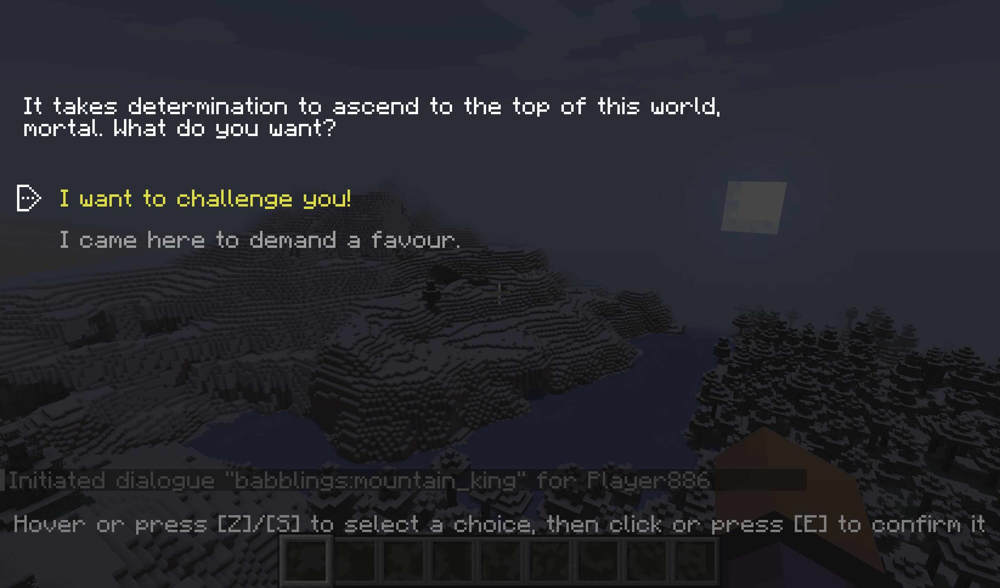
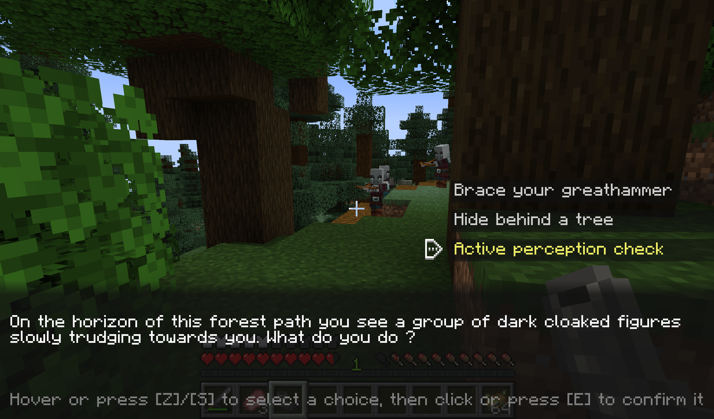
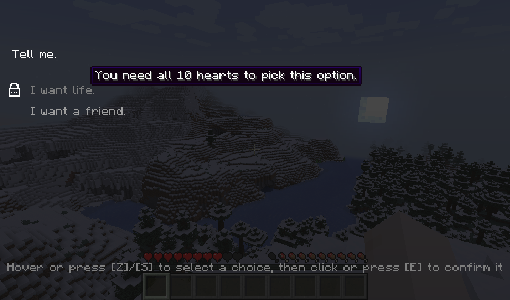
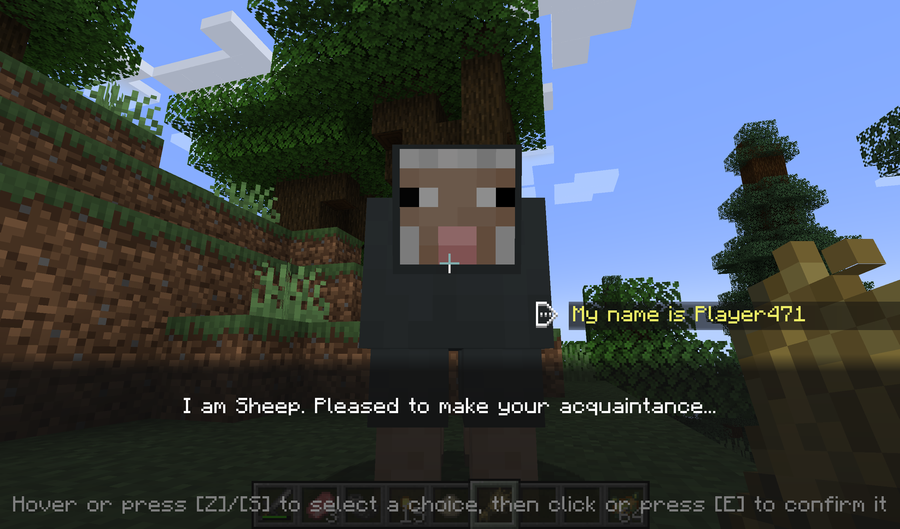

Are you a modpack maker who wants their players to talk to more than a quest book?
Are you a modded server owner who wants to sprinkle some ✨immersion✨ in their world?
Are you perhaps a modder who is looking for an easy-to-use dialogue library with expansive tooling?

Blabber is a mod and library for displaying interactive dialogues to your players.
Just write your dialogue description files, then start them on demand!

## How it looks

Like that:

{:.rounded}

Or like that:

{:.rounded}

You get to choose per-dialogue.

## How it works

### Commands

Blabber adds the `/blabber` command, allowing server operators and mapmakers to interact with the mod through commands.

- `/blabber dialogue`
    - `/blabber dialogue start <dialogue> [<targets>] [<interlocutor>]` : Starts a dialogue for one or more players.
        - `<dialogue>` : the unique identifier for the dialogue
        - `[<targets>]` (optional) : If specified, must be either a player's username or a target selector. If unspecified, defaults to the player using the command. When used in a command block, `[<targets>]` is not optional.
        - `[<interlocutor>]` (optional) : If specified, must be a target selector for a single entity. If unspecified, defaults to no interlocutor.

### Format

Blabber will automatically load all JSON files in the `data/[namespace]/blabber/dialogues` directory.
Those can be provided either by mods, or by datapacks. They will also be reloaded when running `/reload`, just like
tags and functions.

Each file describes the various states a dialogue can be in.

Here's a super basic example:

<figure class="mediafigure">

<figcaption>State diagram for a dialogue with 2 intermediate states and 2 end states</figcaption>
</figure>

This dialogue has 5 states: `start`, `accept`, `end_success`, `refuse`, and `end_failure`.
When a player gets this dialogue, they will first be shown "Do you want potatoes?" with the options "Yes please!" and "No thanks.".

- If they click "Yes please!", they will switch to the `accept` state and be shown the text "Alright, have potatoes" with the only choice "ok".
When they click on that choice, they will switch to the `end_success` state, which ends the dialogue.

- If they click "No thanks.", they will switch to the `refuse` state and be shown the text "Are you sure?" with the choices "yes" and "I changed my mind." being available.
    - If they click on "yes", they will switch to the `end_failure` state, which also ends the dialogue. 
    - However, if they click on "I changed my mind", they will switch to the `accept` state, and be shown the same text and only choice.

Of course, this would be quite useless if we didn't give the player their potatoes.
We can fix this by adding an action to the `end_success` state; a command action with the value `/give @s potato 12` should do nicely.

Here's the JSON file corresponding to what we just described:

<h4 id="basic-dialogue-json" class="no_anchor">basic-dialogue.json</h4>

```json

```



#### Text

Texts in dialogues use the [standard minecraft text format](https://minecraft.wiki/w/Raw_JSON_text_format#Java_Edition).

A couple of things to keep in mind :

- you can write `\n` in text literals or translations to make a new line
- fancy text content like entity selectors should work as expected,
  however they are resolved only once at the start of a dialogue
  (which means if you use a "nearest entity" selector and entities around the player move,
  the selector will keep targeting the one that was closest when the dialogue started)

#### Layout

As noted in [the previous section](#how-it-looks), you can choose if your dialogue uses the classic layout, or the RPG
layout (first and second screenshot, respectively).

When using the RPG layout, be mindful of how many choices you have and how long they are. While they may fit
on the screen just fine in languages like English, they may take up too much space once translated
(this also applies to the classic layout, though to a lesser degree).
{:.admonition.admonition-important.admonition-icon}

The JSON looks like this (goes at the top level, replace `"blabber:classic"` with `"blabber:rpg"` for the alternative look):

<h5 id="simple-layout-json" class="no_anchor">Simple layout JSON</h5>

```json
{
  "layout": {
    "type": "blabber:classic"
  }
}
```



#### Conditional choices

So what if you want to add requirements for specific dialogue paths? You could always make a separate dialogue file
for each possible combination and trigger one based on prior conditions, but that becomes quite tedious when you have multiple
conditions in a single dialogue, and it also does not give players any indication of what choices they may have missed.

To help with that situation, Blabber gives you the ability to lock some dialogue choices behind [predicates](https://minecraft.wiki/w/Predicate).
Here is what a locked choice may look like:

{:.rounded}

When you make a choice conditional, you specify when the choice should be available, and how it should be displayed if not.
The condition is given as an identifier for a [predicate](https://minecraft.wiki/w/Predicate).

Mods can register their own `LootCondition`s to allow virtually any check in said predicates.
{:.admonition .admonition-note .admonition-icon}

As for the display, you can either make it so the choice is *grayed out*, displaying a little lock icon and explanation message when hovered, or
set it to be *hidden*.

Note that you should avoid the hidden option with choices that can enable or disable themselves mid-dialogue, as it may cause some frustration due to player misclicks.
{:.admonition .admonition-warning .admonition-icon}

Here is an example of conditional choices in JSON:

<h5 id="grayed-out-choice-json" class="no_anchor">Grayed out choice JSON</h5>

```json
{
  "text": "I have money.",
  "next": "barter",
  "only_if": {
    "predicate": "testmod:holding_emerald",
    "when_unavailable": {
      "display": "grayed_out",
      "message": "You must be holding an emerald to pick this option."
    }
  }
}
```


<h5 id="hidden-choice-json" class="no_anchor">Hidden choice JSON</h5>

```json
{
  "text": "I have money.",
  "next": "barter",
  "only_if": {
    "predicate": "testmod:holding_emerald",
    "when_unavailable": {
      "display": "hidden"
    }
  }
}
```



The full example with predicate included is available in [Blabber's test mod](https://github.com/Ladysnake/Blabber/tree/main/src/testmod/resources/data/babblings).

### Interlocutors

Of course, dialogues often involve talking to *someone* (or something). Since version 1.2.0, Blabber lets you specify
an *interlocutor* entity when starting a dialogue (using an optional argument in the command / in the API).


```
blabber dialogue start <dialogue> @s @e[limit=1,sort=nearest]
```

<figure>
<figcaption>Example command to start a dialogue with the closest entity as interlocutor</figcaption>
{{ example | markdownify }}
</figure>

This relationship can be used in several ways:

#### In commands and texts

Blabber adds a new `@interlocutor` selector, which targets the current interlocutor of the command's source.
It only works when `@s` is a player, which includes commands run from dialogue actions and commands run through `execute as <player> run ...`.

Example use:


```
effect give @interlocutor regeneration
```

<figure>
<figcaption>Command using @interlocutor</figcaption>
{{ example | markdownify }}
</figure>


```json
{
  "text": [
    {"text":"I am "},
    {"selector":"@interlocutor"},
    {"text":". Pleased to make your acquaintance..."}
  ]
}
```

<figure>
<figcaption>Text using @interlocutor</figcaption>
{{ example | markdownify }}
</figure>

You can use `@interlocutor` in any of a dialogue's text, including choices and locked content hints.
You can also use any other selector in the same way, keeping in mind that `@s` will refer to the player themselves.
{:.admonition.admonition-note.admonition-icon}

Here is how the above text may be used:

{:.rounded}

#### In predicates

The interlocutor entity can also be used in [predicates files](https://minecraft.wiki/w/Predicate) by using the `blabber:interlocutor_properties` condition type.
This new condition type lets you apply the same checks to a player's current interlocutor as `minecraft:entity_properties`
would on the player themselves.

For example:
```json
{
  "condition": "blabber:interlocutor_properties",
  "predicate": {
    "type": "minecraft:villager"
  }
}
```

### Online Dialogue Maker

If you are allergic to code, try this online tool: [blabber dialogue editor](dialogue_generator)

<div class="mediafigure">
<iframe width="672" height="378" src="https://www.youtube.com/embed/Hm_bQlgqSCQ?si=A5SH8mRNEkGSi14i" title="YouTube video player" frameborder="0" allow="accelerometer; autoplay; clipboard-write; encrypted-media; gyroscope; picture-in-picture; web-share" allowfullscreen></iframe>
</div>

### Validation

To help creators design dialogues, and prevent players from getting stuck in a *(possibly non-skippable)* dialogue with no ending,
both the online dialogue maker and the mod itself will perform several validation checks on dialogue files.

The validation process checks for the following issues and reports them by either logging a warning or failing with an error:

**Errors:**
- **States with no choices:** Every non-end state must have at least one choice leading out of it. If any state has no choices defined, an error will be thrown.
- **Softlock states:** Every state must have a path leading to an ending (no infinite loops). If any state is lacking a path to an end state, an error will be thrown.

**Warnings:**
- **Conditional softlock states:** Any state that only has *conditional* paths leading to an ending will be reported. Blabber cannot tell whether a condition will necessarily be fulfilled when getting to such a state, and thus cannot prove that the player *will not* be softlocked.
- **Unreachable states:** Any state that is disconnected from the main dialogue graph will be reported with a warning message. While they do not cause immediate issues for players, you may want to connect or remove such orphan states.

## Mod Compatibility

### Heracles

The [Heracles](https://modrinth.com/mod/heracles) quest mod can be used with the [Heracles for Blabber](https://modrinth.com/mod/heracles-for-blabber) add-on
to incorporate dialogues into your modpack's or server's quests.

### Text Animator

The [Text Animator](https://modrinth.com/mod/text-animator) mod can be used to add special effects to your dialogues' texts :

<figure class="mediafigure">
<video controls width="650">
<source src="textanimator-blabber-demo.mp4" type="video/webm" />
Download the
<a href="textanimator-blabber-demo.mp4">MP4</a>
video.
</video>
<figcaption>Text animator with Blabber demo (warning: movement and color flashes)</figcaption>
</figure>


## Using Blabber (for developers)

If you are a developer, you can use Blabber as a library for your own project by inserting the following in your `build.gradle` :

You can then add the library version to your `gradle.properties`file:


[- groovy -]
`gradle.properties`:
```properties
# Blabber
blabber_version = <BLABBER_VERSION>
# Fabric Permissions API
fpa_version = 0.2-SNAPSHOT
# Cardinal Components
cca_version = <CCA_VERSION>
```

`build.gradle`:
```gradle
repositories {
    maven { 
        name = "Ladysnake Mods"
        url = "https://maven.ladysnake.org/releases"
        content {
            includeGroup 'io.github.ladysnake'
            includeGroup 'org.ladysnake'
            includeGroupByRegex 'dev\\.onyxstudios.*'
        }
    }
    maven {
        name = "Nexus Repository Manager"
        url = "https://oss.sonatype.org/content/repositories/snapshots"
    }
}

dependencies {
    modImplementation "org.ladysnake:blabber:${blabber_version}"
    include "org.ladysnake:blabber:${blabber_version}"
    // Blabber dependencies
    include "me.lucko:fabric-permissions-api:${fpa_version}"
    include "dev.onyxstudios.cardinal-components-api:cardinal-components-base:${cca_version}"
    include "dev.onyxstudios.cardinal-components-api:cardinal-components-entity:${cca_version}"
}
```

[- kts -]
`gradle.properties`:
```properties
# Blabber
blabber_version = <BLABBER_VERSION>
# Fabric Permissions API
fpa_version = 0.2-SNAPSHOT
# Cardinal Components
cca_version = <CCA_VERSION>
```

`build.gradle.kts`:
```kotlin
repositories {
    maven {
        name = "Ladysnake Mods"
        url = "https://maven.ladysnake.org/releases"
        content {
            includeGroup("io.github.ladysnake")
            includeGroup("org.ladysnake")
            includeGroupByRegex("""dev\.onyxstudios.*""")
        }
    }
    maven {
        name = "Nexus Repository Manager"
        url = "https://oss.sonatype.org/content/repositories/snapshots"
    }
}

dependencies {
    val blabberVersion = property("blabber_version") as String
    val ccaVersion = property("cca_version") as String
    val fpaVersion = property("fpa_version") as String
    modImplementation("org.ladysnake:blabber:${blabber_version}")
    include("org.ladysnake:blabber:${blabber_version}")
    // Blabber dependencies
    include("me.lucko:fabric-permissions-api:${fpa_version}")
    include("dev.onyxstudios.cardinal-components-api:cardinal-components-base:${cca_version}")
    include("dev.onyxstudios.cardinal-components-api:cardinal-components-entity:${cca_version}")
}
```

[- catalogue -]
`libs.versions.toml`:
```toml
[versions]
blabber = '<BLABBER_VERSION>'
cardinalComponentsApi = '<CCA_VERSION>'
fabricPermissionsApi = '0.2-SNAPSHOT'

[libraries]
cca-base = { module = "dev.onyxstudios.cardinal-components-api:cardinal-components-base", version.ref = "cardinalComponentsApi" }
cca-entity = { module = "dev.onyxstudios.cardinal-components-api:cardinal-components-entity", version.ref = "cardinalComponentsApi" }
fpa = { module = "me.lucko:fabric-permissions-api", version.ref = "fabricPermissionsApi" }
blabber = { module = "org.ladysnake:blabber", version.ref = "blabber" }

[bundles]
blabber = [ "cca-base", "cca-entity", "fpa", "blabber" ]
```

`build.gradle` or `build.gradle.kts`:
```kotlin
repositories {
    maven {
        name = "Ladysnake Mods"
        url = "https://maven.ladysnake.org/releases"
        content {
            includeGroup("io.github.ladysnake")
            includeGroup("org.ladysnake")
            includeGroupByRegex("""dev.onyxstudios.*""")
        }
    }
    maven {
        name = "Nexus Repository Manager"
        url = "https://oss.sonatype.org/content/repositories/snapshots"
    }
}

dependencies {
    // Replace modImplementation with modApi if you expose Blabber's interfaces in your own API
    modImplementation(libs.bundles.blabber)
    // Includes Blabber and its dependencies as a Jar-in-Jar dependency (optional but recommended)
    include(libs.bundles.blabber)
}
```




You can find the current version of Blabber in the [releases](https://github.com/Ladysnake/Blabber/releases) tab of the repository on Github,
and the latest CCA version in the [appropriate repository](https://github.com/OnyxStudios/Cardinal-Components-API/releases).

### API

The two most relevant methods are as follow:
- `Blabber#startDialogue(ServerPlayerEntity, Identifier)`: starts the dialogue with the given id for the given player
- `Blabber#registerAction`: registers an action for use in dialogues, 2 overloads available:
  - `registerAction(Identifier, DialogueAction)`: registers a simple action that takes no additional configuration from the dialogue description file.
  - `registerAction(Identifier, Codec<? extends DialogueAction)`: registers an action type. The codec is used to create new dialogue actions based on the action `value` specified in the dialogue description file.

#### Custom layouts

It is possible to register your own custom layout with its completely custom screen by calling `BlabberScreenRegistry#register`
in your client entrypoint. The API is however marked unstable, as the layout system is susceptible to being refactored to allow arbitrary data being passed to the screen
(contributions welcome).

### JSON Schema

The schema for Blabber dialogue files is available here: [dialogue.schema.json](dialogue.schema.json)
