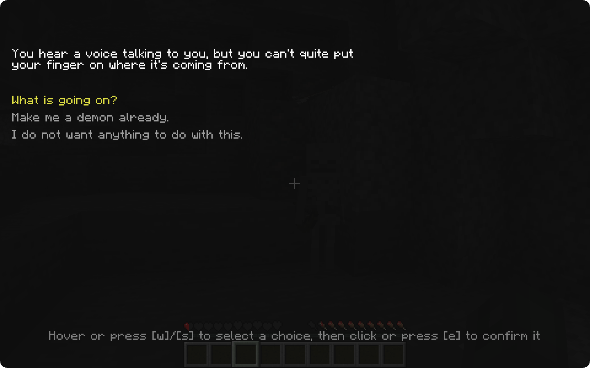
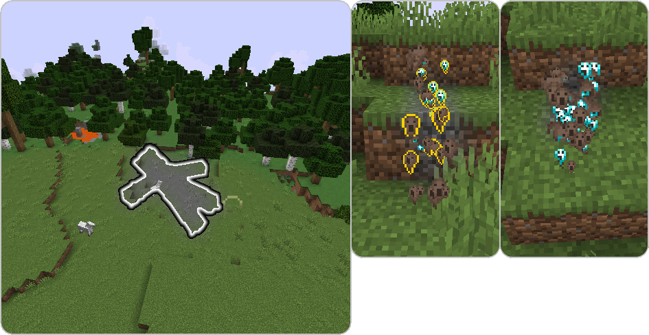

## First Death

Upon dying for the first time in a world, a **dialogue** will be prompted to the player. In this menu, the
player can select **whether or not they want to become a demon**, and **activate the mod for themselves or not**.
After choosing, the player obtains the "A Devilish Conundrum" and **the dialogue will not be prompted anymore**.
However, the player can still **change their mind** by using the [**Mortician's conversion trade**](mortician#conversion-trade) at a later time.

#### Hardcore Mode

In order to keep the challenge of Hardcore mode, this dialogue will **not** appear. Instead, you will have to use the [**Mortician**](mortician) to become a remnant.

#### Origins Compatibility
With the [**Origins**](https://www.curseforge.com/minecraft/mc-mods/origins) mod installed, the choice is made through its **selection screen** when first joining the world. This does **not replace the actual origin choice**, players choose both a soul type and an origin.

## Soul State

**If the player is a demon and dies**, their **demon soul dissociates from the host** and escapes the destroyed body. 

Later, this dissociation process can be done using the corresponding keybind ( "," by default) if the player has the [**Emancipation Soul Effect**](effects#emancipation), leaving behind the body **without killing it**. 

Golems can also be dissociated from at any given time.

While dissociated, the player has **creative flight** and **night vision**, can **glide through the air** (similarly to how a player would swim) and **phase through most blocks**. 

In order to phase, the player must walk into the wall they want to phase through for a few seconds. Then, soul particles will appear and the player can enter the phasing state, slowly moving through solid blocks. While phasing, **mobs will be highlighted** to guarantee orientation and make finding hosts a lot easier. 

Once a host is found, [it can be **possessed**](possession) **by clicking it** (a soul icon should render upon placing the cursor on an entity).

**Remnant players can only possess soulless mobs!** Some mobs are **soulless by default**, such as undead mobs and golems. Others, like pigs, goats or axolotls must have their **soul removed before they can be possessed**. This is done using the [**Soul Vessel**](soul-vessels#empty-soul-vessel).

The list of **soulless** Vanilla Minecraft mobs is as follows:

- **Undead Mobs**
  - Skeleton
  - Stray
  - Wither Skeleton
  - Skeleton Horse
  
  - Zombie
  - Drowned
  - Husk
  - Zombie Villager
  - Zombified Piglin
  - Zombie  Horse
  - Zoglins
- **Golems**
  - Iron Golem
  - Snow Golem
  - Shulker

## Body Transformation after Death

In some cases, the player's **body might transform after death**, giving birth to an undead creature. In those few situations,
the player's **soul is not expelled** from the dying body and **keeps full control and inventory** of it.

The list of events that lead to a body transformation after death is as follows:

- Dying from a **Zombie or a Drowned *while in the dark*** will turn the player into a **Zombie**
- Dying in **lava** while being in the **Nether** will turn the player into a **Wither Skeleton**
- Dying from **suffocation by sand** will turn the player into a **Husk**
- Drowning in an **ocean far enough from the surface** will turn the player into a **Drowned**
  - As Vanilla game behavior guarantees, **staying too long underwater as a Zombie will turn the player into a Drowned**

## Becoming Human Again

To recover their humanity and get rid of their rotting body, an undead player has to go through the purification
process every Zombie Villager must. By getting the **Weakness effect**, undead players are able to **eat Golden Apples**. After eating the Golden Apple, the weakness will turn into strength. As soon as the strength runs out, the **player turns back into human** form. This process **can even be done by others**, similar to how players can cure Zombie Villagers.

**Note that only humanoid undead can be converted to player bodies.**

There are also some special conversions for certain mobs:

- **Zombie Villagers will turn into Villagers after being cured**. These Villagers will be **possessable** without the need of removing their soul.
- **Zombified Piglins will turn into Piglins or Piglin Brutes**, depending on their previous life. Cured Piglins **won't zombify in the Overworld**.
