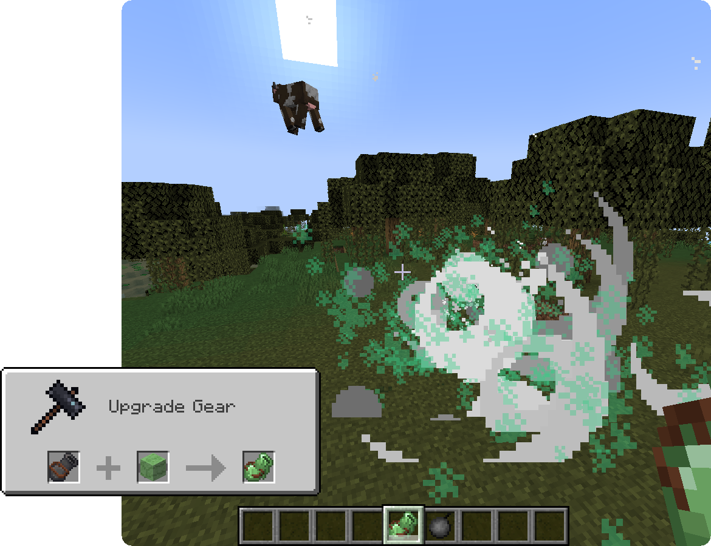
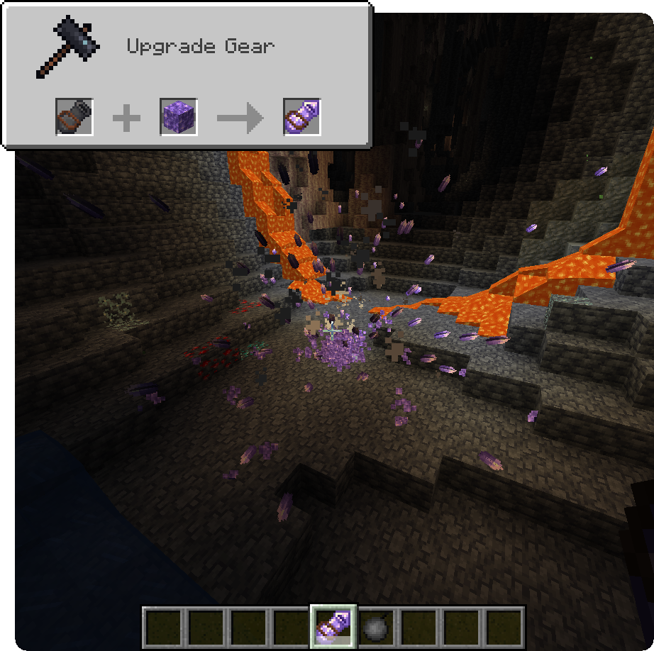
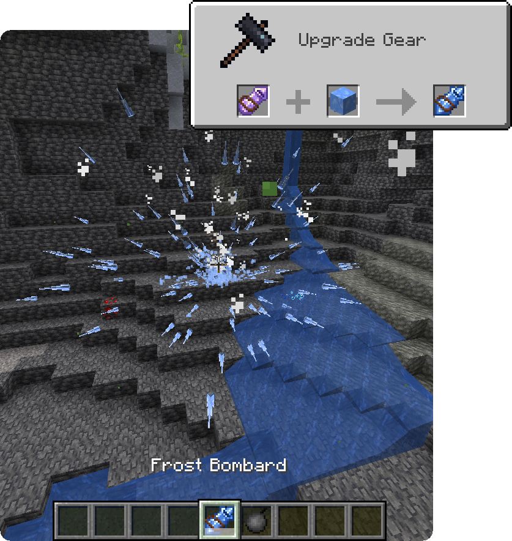
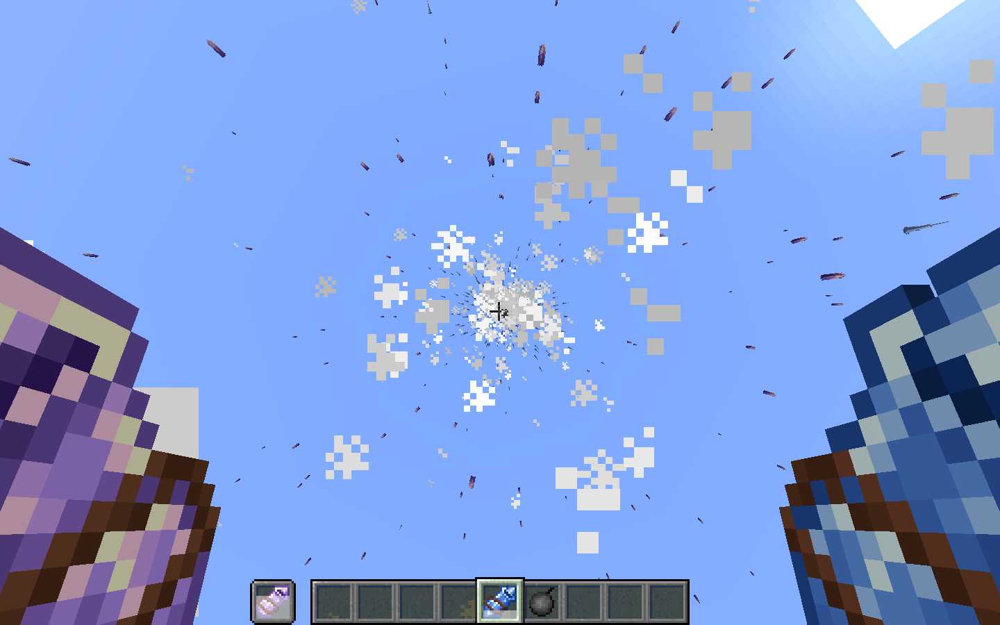

BLAST is a Minecraft fabric mod adding multiple explosives for use in survival or for messing around in creative to the game.

# Features

Blast bombs will **drop all lootable blocks** and do **not destroy dropped items**; these items however are submitted to the bomb shockwaves (meaning items can go flying if you throw multiple bombs into a single spot).

## Bombs

### Basic Bombs

### Dirt Bombs

Dirt Bombs can be crafted by surrounding normal bombs with 8 Dirt Blocks. Instead of destroying blocks however, they will **create a dirt pile wherever they explode.** As such, they are a great counter to creeper holes!

### Pearl Bombs

Crafted like normal bombs with an Enderpearl as base material, this bomb has a **silk touch effect on all block in the explosion** radius. As a side effect, it will also **randomly teleport entities** that get caught in the explosion.

### Confetti Bombs

Confetti Bombs come, as most other bombs, in 2 variation: As a trigger bomb and as a timed bomb. Instead of blowing your world up however, Confetti bombs make it prettier: **They will spread confetti particles upon exploding!** Those particles come in multiple different colours and **remain on the ground for 1 minute** after the explosion. Confetti Bombs are crafted shapelessly with 7 Paper, 1 Gunpowder and either 1 String (timed, top) or 1 Redstone Dust (trigger, bottom).

### Naval Mines

Naval Mines are bombs that trigger on impact, **can destroy blocks underwater** and **will not sink** when thrown in water. Other than standard bombs the naval mine has an explosion power of 4.

## Bombards

Bombards can be used to **launch [normal Bombs and Trigger Bombs](#basic-bombs)** a **lot further** and will **negate their destructive capabilities** but **keep their damage to entities**. They have a **small cooldown** and will transform your bombs to **add special effects** to the explosion.

### Bombard

This most basic Bombard can be crafted using 6 Iron Ingots, 1 Cauldron, 1 Piston and 1 Lever. It doesn't add new effects to the bombs but is the **base item for the other Bombards**.

### Slime Bombard

Bombards can be upgraded to Slime Bombards using a Slime Block on a Bombard in the Smithing Table. Bombs launched using the Slime Bombard do **not deal any damage** to entities but have **increased knockback!**

### Amethyst Bombard

Crafted by applying an Amethyst Block to a Bombard in the Smithing Table, the Amethyst Bombard **adds amethyst shards to your explosion**, at the **cost of the explosion damage**. These shards will spread in all directions and **deal 2 (1 heart) damage per shard**.

### Frost Bombard

Being an upgrade to the Amethyst Bombard, the Frost Bombard is crafted by adding Blue Ice to it in the Smithing Table and **replaces the amethyst shards with icicles.** These icicles deal only **0.5 damage (1/4 of a heart)** but **apply freezing effects** to their targets.

## Blocks

### Gunpowder Block

The Gunpowder Block is a compact way of storing gunpowder. When placed it is **highly sensitive to explosions and fire** and will explode allmost instantly when in contact with them. The explosion it creates is fiery and has a power of 4.

### Stripminer

The Stripminer is **triggered like TNT** and **focuses the explosion in one direction.** It creates a 3x3+ wide tunnel and usually points the way the player is looking upon placing it down, this, however, is inverted while sneaking. When the stripminer is set off by other explosives the direction can get misaligned and the fuse time varies slightly.

### Cold Digger

The Cold Digger is an upgrade to the Stripminer that keeps the functionality of creating a 3x3 wide tunnel but **replaces additional blocks around it with Dry Ice and, in the case of lava, Basalt.** It is crafted by surrounding the Stripminer with 4 Packed Ice Blocks.

#### Dry Ice

Dry Ice is a kind of ice that **does not melt or create water** upon breaking. It emits particles and can be mined using silk touch. 

# FAQ
#### Can I include this mod in a modpack?

**Yes**, you can. Go ahead, don't bother asking. Please  however provide credit and a link to both the GitHub repository and  Curse Forge project page.

#### Can you port to Forge please? Backport to version X?

We don't port our mods to forge or backport them for various reasons. If you want to make a port yourself however feel free to [come chat with us about it](https://ladysnake.glitch.me)!

# Gallery

