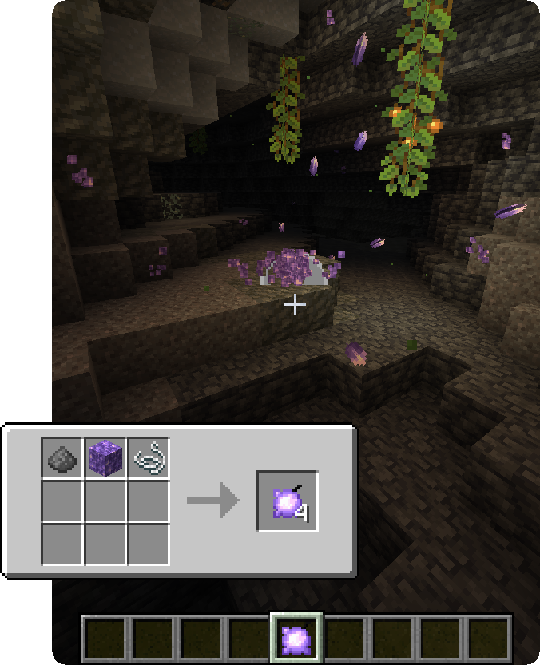

BLAST is a Minecraft fabric mod adding multiple explosives for use in survival or for messing around in creative.

# Features

BLAST mainly focuses on various types of bombs with some common attributes:

- BLAST bombs **drop all lootable blocks** they destroy

- **Items are not destroyed** by explosions but **can be knocked back** by the blasts

- Bombs make **stacks of 16** and have a **1 second cooldown** outside of creative mode

  

## Bombs

### Basic Bombs

### Dirt Bombs

Dirt Bombs can be crafted by surrounding normal bombs with 8 Dirt Blocks. Instead of destroying blocks however, they will **create a dirt pile wherever they explode.** As such, they are a great counter to creeper holes!

### Pearl Bombs

Crafted like normal bombs with an Enderpearl as base material, this bomb has a **silk touch effect on all blocks in the explosion** radius. As a side effect, it will also **randomly teleport entities** that get caught in the explosion.

### Confetti Bombs

Confetti Bombs come, as most other bombs, in 2 variants: As a trigger bomb and as a timed bomb. Instead of blowing your world up however, Confetti bombs make it prettier: **They will spread confetti particles upon exploding!** Those particles come in multiple different colours and **remain on the ground for 1 minute** after the explosion. Confetti Bombs are crafted shapelessly with 7 Paper, 1 Gunpowder and either 1 String (timed) or 1 Redstone Dust (trigger).

### Slime Bombs

Slime Bombs can be crafted using **1 gunpowder, 1 Slimeball and 1 String/Redstone Dust**. Slime Bombs do **not deal any damage** to entities but have **increased knockback!**

### Amethyst Bombs

Crafted like any other bomb with an **Amethyst Block as base material**, the Amethyst Bomb **adds 70 amethyst shards to your explosion**, at the **cost of the normal explosion damage**. These shards will spread in all directions and **deal 8 damage (4 hearts) per shard**.

### Frost Bombs

Being an alternative to Amethyst Bombs, Frost Bombs are crafted by adding **Packed Ice as base material** and **replace the amethyst shards with icicles.** These icicles deal only **0.01 damage** but **apply freezing effects** to their targets, bypassing armor without damaging it.

### Naval Mines

Naval Mines are bombs that trigger on impact and **can destroy blocks underwater**. In comparison to standard bombs the naval mine has an explosion power of 4 and **only** exists as a **trigger bomb** variant.

## Blocks

### Gunpowder Block

The Gunpowder Block is a compact way of storing gunpowder. When placed it is **highly sensitive to explosions and fire** and will explode allmost instantly when in contact with them. The explosion it creates is fiery and has a power of 4.

### Stripminer

The Stripminer is **triggered similarly to TNT** and **focuses its explosion power in one direction.** It creates a 3x3+ wide tunnel and usually points the way the player is looking upon placing it down, this, however, is inverted while sneaking.
When the stripminer is set off by other explosives the direction can get misaligned and the fuse time varies slightly.

### Cold Digger

The Cold Digger is an upgrade to the Stripminer that keeps the functionality of creating a 3x3 wide tunnel but **replaces additional blocks around it with Dry Ice and, in the case of lava, Basalt.** It is crafted by surrounding the Stripminer with 4 Packed Ice Blocks.

#### Dry Ice

Dry Ice is a kind of ice that **does not melt or create water** upon breaking. It emits particles and can be mined using silk touch.

# FAQ
#### Can I include this mod in a modpack?

**Yes**, you can. Go ahead, don't bother asking. Please  however provide credit and a link to both the [GitHub repository](https://github.com/Ladysnake/BLAST) and  [Curse Forge project page](https://www.curseforge.com/minecraft/mc-mods/blast).

#### Can you port to Forge please? Backport to version X?

Sorry, we **don't** port our mods to forge or backport them for various reasons.

# Gallery

