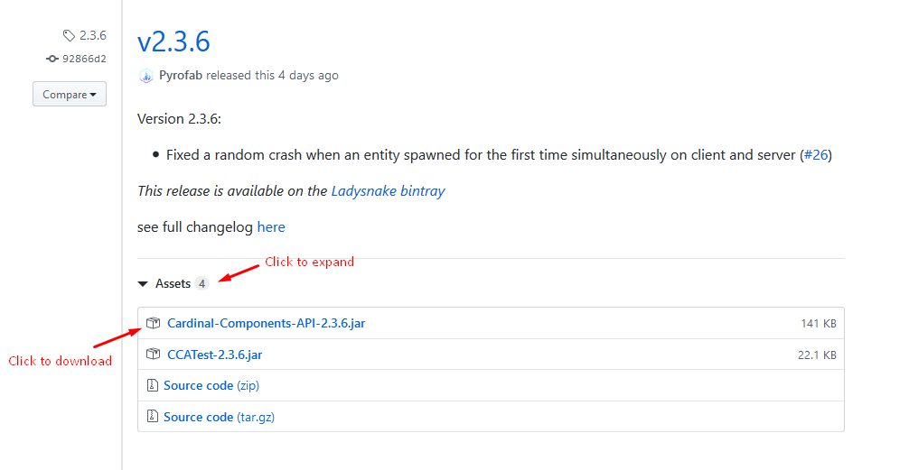

**It is normally not required for users to install Cardinal Components API**, as mods should bundle it with their own releases. If a built jar is still needed, either because a mod did not bundle it or because a newer version than bundled is required (eg. critical bugfix), there are 3 main ways of obtaining it.

## Modrinth

Cardinal Components is [available on Modrinth](https://modrinth.com/mod/cardinal-components-api) and can be downloaded or added to a modpack like any other mod.

## Curseforge

Cardinal Components is also [available on Curseforge](https://www.curseforge.com/minecraft/mc-mods/cardinal-components-api). If you are a mod developer, you may want to link to that page by declaring Cardinal Components as an *embedded library* of your mod.

## Github releases

Built jars can be found for every version in the [Releases tab on GitHub](https://github.com/Ladysnake/Cardinal-Components-API/releases). Just find the version you need, then click on the `Cardinal-Components-API-<VERSION>` link in the `assets` drop-down.

{:.wiki}
