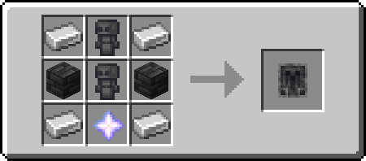

Charter is a Minecraft fabric mod allowing for a more dynamic faction and claiming system without breaking the game immersion.

#  Contract

Contracts are the **starting point** of Charter. Signing them **links your soul to the contract** which can be used in various ways later on.

Contracts are crafted using 2 Leather, 2 Paper, 1 Wither Rose or Wither Skeleton Skull and 1 Soul Sand or Soul Soil.

###  Merchant's Crest

A mysterious item, **found in treasure bastions**, that allows you to **teleport to an Indebted** and granting you a **short burst of invisibility** by using it with a contract in your other hand. Use it again to **warp back to your original position**.

###  Eternal Pact 

The Eternal Pact renders, at a cost, **all players you hold the contract of immortal**.

The affected players will not be able to die but are applied the Eternal Debt effect, **blinding them and decreasing mining speed**, progressively **increasing in severity as the victims lose more health**.
Additionally, contact with **water will inflict the wither effect** on them, further increasing the strength of the debuffs.

###  Pact Vessel

The Pact Vessel allows to use the link between a contract and its owner in a more constant way than the Merchant's Crest, **adding the connected player to a charter once placed in its range** or, if activated by **placing a soul fire source** (soul fire, soul lantern, soul torch or soul campfire) 2 blocks under the Pact Vessel, **applies the [Soul Strain](#-soul-strain) effect** to the victim. It can also be used with the [**Soul Swapper**](#-soul-swapper) in order to **swap bodies** with another player.

The Pact Vessel can be crafted using 4 Iron Ingots and 3 Deepslate Tiles as frame with 1 Soul Sand or Soul Soil block in the middle and 1 Chiseled Deepslate above.

####  Soul Strain

Soul Strain is a new status effect meant to punish the player by **doubling the damage taken** and turning **all damage to magic damage**.

####  Soul Swapper

The Soul Swapper **swaps the 2 blocks on either end of it** on redstone input, emitting light once activated. If the 2 blocks are **[Pact Vessels](#-pact-vessel) holding [Contracts](#-contract)**, the 2 corresponding players will **switch bodies**, changing positions and bodies.

*Soul Swappers do not have a crafting recipe yet, use datapacks, custom commands or shops to make this content accessible.*

# Charter

**A Charter is a claim**, centered around the Charter Stone. Only Charter members can **place or break blocks** within its area of influence. 

Charters start off with a **square-shaped area of 64x64 blocks around the Charter Stone** and **infinite height**. Players can be **added as members by placing a [Pact Vessel](#-pact-vessel)** with their contract within the range of the charter, also rendering them **unable to hit the respective Charter owner**.

But this claim has a cost: Over time, **the Charter will require sacrifices** in the form of [**Charter Vessels**](#-charter-vessel) to avoid [**Soul Strain**](#-soul-strain) being applied to its members.

A Charter can **only be destroyed by breaking the central Charter Stone**.

###  Charter Stone

The Charter Stone is the heart of each Charter. Every player can **only place down a single one of these** - which will make them the owner of the newly created charter and apply Resistance 1 to them while near it - and **only the owner dying near the Charter Stone can destroy it**.
Once a Charter Stone is destroyed it will lose its power, turn into a broken variant and **break all of the [Waystones](#-waystone)** of the same Charter.

Charter Stones are made using 6 Deepslate Tiles on the sides of the crafting grid and 2 Waystones with 1 Apex Focus in between.

####  Apex Focus

The Apex Focus is a crafting **ingredient of the Charter Stone**. The only way to obtain one is by **mining a broken Charter Stone**.

***In the current version it is recommended to use datapacks, custom commands or shops to make this content accessible as there is no default way to obtain charters yet!***

###  Charter Vessel

Charter Vessels can be placed within the range of a Charter Stone to **prevent the members of the respective Charter to get the [Soul Strain effect](#-soul-strain)**.

###  Waystone

Waystones can **increase the size of a Charter** if placed within its range. Its area of influence is **a square of 32x32 blocks** and **infinite height**.
It can be **destroyed by killing a Charter member** in its range, turning it into a mineable, broken variant.

They can be crafted by combining 8 Deepslate Tiles and 1 Ender Pearl.

