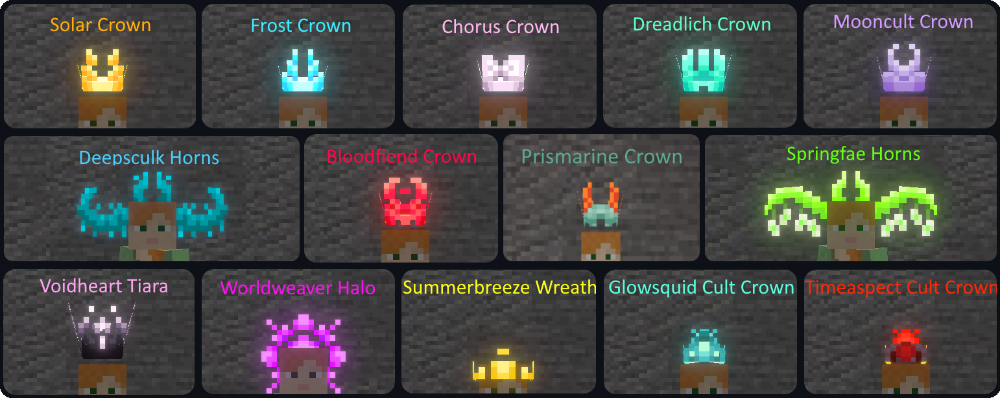

# Illuminations

**

**Illuminations** is a client sided Minecraft Fabric mod that adds multiple ambient particles in order to make your world more enjoyable at night or in dark places.
This mod is compatible with the [Canvas Renderer](https://www.curseforge.com/minecraft/mc-mods/canvas-renderer).

*(All screenshots with a bloom effect were taken with Canvas Renderer installed)*

## Ambience

### Overworld

#### Fireflies

**Fireflies** are small flying insects that come out during the night and disappear when the sun rises. They will appear in small quantities in jungle, plains, savanna and taiga type biomes, medium quantities in forest and river type biomes and great quantity in swamp type biomes.

{: .wiki}

#### Glowworms

**Glowworms** are small larvae living in caves by sticking to the ceiling that will fall down if their support block is removed. They will appear in small quantities in jungle, plains, savanna and taiga type biomes, medium quantities in forest and river type biomes and great quantity in swamp type biomes.

{: .wiki}

#### Glowing Plankton

**Glowing Plankton** - even though difficult to notice because of its size - can be found floating around in the dark parts of the oceanic depths. They appear in any ocean biome as long as the light is sufficiently low.

{: .wiki}

### Halloween (October Specials)

#### Autumnflies

During the month of October, fireflies will adopt an orange tint instead of their regular green one.

{: .wiki}

#### Eyes in the Dark

Also during the month of October, you may come across glowing eyes in absolutely dark spots. These eyes will disappear if you come too close or if their darkness is disturbed by a light source.

{: .wiki}

### Nether and End

#### Will o' Wisps

**Will o' Wisps** are rare small ghost-like creatures that appear in Soul Sand Valleys, flying through the air and phasing through Soul Sand. They also appear from Soul Lanterns, allowing the player to create a magical or eerie ambience by decorating their surroundings with those.

{: .wiki}

{: .wiki}

#### Chorus Petals

Appearing near Chorus flowers, these beautiful petals will twirl down to the ground, to the winds of the End, transitioning from a beautiful white to a majestic purple. The younger the flower is, the more petals will appear, and breaking a Chorus flower will provoke a burst of petals (again, the younger the flower, the more petals will burst).

{: .wiki}

## Special Features

### Jeb Easter Egg Expansion

*(Requires [Satin API](https://www.curseforge.com/minecraft/mc-mods/satin-api/), feature disabled with Canvas and Iris because of compatibility issues*

Renaming any mob in the game to jeb_ will apply a rainbow effect to it. This feature varies the colour values of the mobs and will work better on colourful mobs such as Creepers, Piglins and Shulkers and will barely make a difference on Skeletons or Wither Skeletons. However, even mobs with fewer colours will glow after being renamed

{: .wiki}

{: .wiki}

{: .wiki}

## Cosmetics

In addition to the ambience changes, Illuminations also features cosmetics, primarily for those who donated and contributed to the project, with the exception of the Pride Heart Collection that is available for all [Accounts](https://illuminations.uuid.gg/register). Cosmetics can be switched and customised using the [Illuminations Dashboard](https://illuminations.uuid.gg/). Since Illuminations is client-side you can use these cosmetics even on servers. Other players with Illuminations will be able to see your cosmetics.

### Pride Hearts

Every Illuminations Account automatically has access to these 7 Pride Hearts that will follow you as pets, hovering next to your head!

{: .wiki}

### Auras

#### Twilight Aura

The **Twilight aura** creates colored fireflies that will orbit around the player. The color of the fireflies can be changed to any color you want via the Illuminations dashboard. If the player moves, they will leave a trail of these fireflies. **This aura is available to tier 1 donators.**

{: .wiki}

#### Auras (Donator Tier 2)

#### Ghostly Aura

The Ghostly Aura will summon the lost souls to scamper around you!

{: .wiki}

#### Chorus Aura

The Chorus Aura makes you stand in a whirl of Chorus Petals, perfectly fit for your adventures in the end!

{: .wiki}

#### Golden Rod Aura

This Aura will give you that extra bit of an ominous glint, summoning Golden Rods all around you!

{: .wiki}

#### Shadowbringer Soul Aura

This dark Aura will strike fear in your enemies as you are sourrounded by a storm of shady ashes!

{: .wiki}

#### Sculk Tendrils Aura

Are you excited for 1.18? This Aura will summon Tendrils from the Deep Dark to follow you and grow around your feet.

{: .wiki}

#### Autumn Leaves Aura

A whirl of orange Leaves following your footsteps to bring that cosy autumn feeling to your world!

{: .wiki}

#### Confetti Aura

This Aura will provide the perfect ambience for your celebrations. The Confetti pieces will stay on the ground for up to 20 seconds, marking your way through the world!

{: .wiki}

#### Prismatic Confetti Aura

A variation of the Confetti Aura that can be adjusted to only be of one colour of your choice.

{: .wiki}

### Overheads

Overheads are different hats that tier 2 donators can decide to wear.

### Pets

Other than the pride hearts tier 2 donators can also equip 5 other pets that will hover next to them and look at what their owner is looking at.

#### Will o' Wisp

{: .wiki}

#### Golden Wisp

{: .wiki}

#### Founding Skull

{: .wiki}

#### Dissolution Wisp

{: .wiki}

#### Jacko

Jacko is a Jack o'Lantern that will light itself when it is night or dark, otherwise it will be extinguished.

{: .wiki}

## Configurability

Illuminations possesses a few config options you can use to change how the mod behaves to better fit your needs.

### Eyes in the Dark

Enable glowing eyes appearing in low light environments. Set on ENABLE by default.
- ENABLE: Eyes will appear during October
- DISABLE: Eyes will never appear
- ALWAYS: Eyes will appear no matter the date

### Spawn Density

The spawn rate percentage multiplier. Does not affect eyes in the dark.
0% Disables illuminations, 1000% Multiplies the amount of illuminations appearing by 10.

### Firefly White Alpha

Changes the Alphachannel of the Firefly centre glow.

### First Person Cosmetics

Enable to see your cosmetics in first person! Disabled by default to not block your view.

## FAQ

#### Can I include this mod in a modpack?

**Yes**: You can. Go ahead, don't bother asking. Please however provide credit and a link to either the GitHub repository or Curse Forge project page.

#### Can I use this mod on a vanilla server?

**Yes**: If you have installed this mod on your Minecraft client, you will be able to connect to vanilla Minecraft servers and the ambient illuminations will work as intended.

#### Are auras visible to other players?

**Yes**: If the player has the mod installed on their client, your aura will be visible to them, just like their aura will be visible to you if they possess one.

#### How to get an aura?

**Auras are currently only available to donators**, if they have donated more than 1$.

#### I wish to support the mod and get an aura. What steps do I need to follow?

In order to get an aura, you will need to make a PayPal donation by following [this link](https://www.paypal.com/donate/?token=khJOtftVs9CuPqxETbT8q2MyRlCrQXkpw-iOaI9NOPJSOpQouUb2Xg1uOifF8ZZDkSoi-W&Z3JncnB0) or via the Curse Forge donate button available on the project page. **When making your donation, please include your Minecraft UUID as well as a valid email address (so I may contact you in case of any problem) in your message.** All donations and aura attributions are manually processed and done as soon as possible, but may take up to a day so please be patient.

***Cosmetics only work on the fabric version of this mod!*** *The forge version is no longer maintained.*

#### I want to change my aura / the color of my prismatic auras / disable it, what do I do?

If you have donated multiple times, you may have multiple auras and may want to select a specific one. Or you may just simply want to change your prismatic color or disable your aura. **You can do all this via the [Illuminations dashboard](https://illuminations.glitch.me/)** with no restrictions whatsoever.

## Gallery

{: .wiki}

{: .wiki}

{: .wiki}