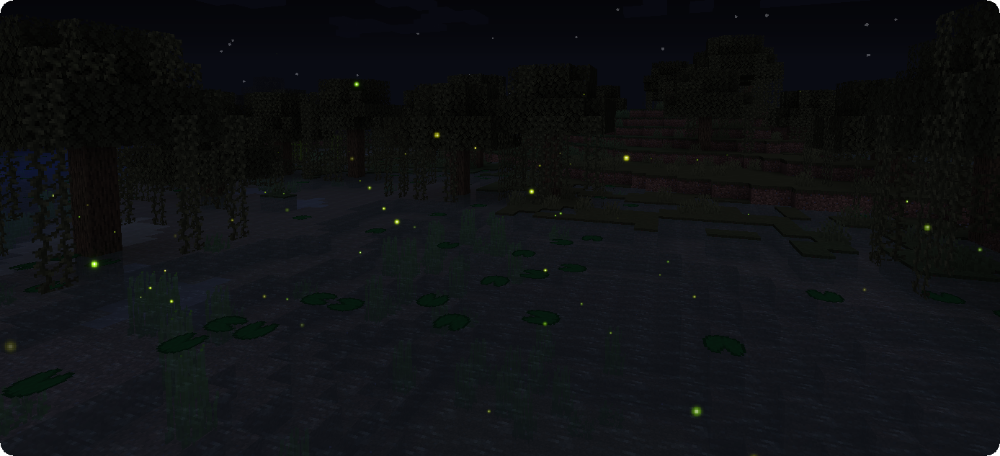
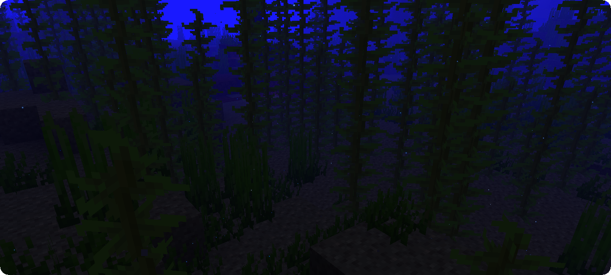
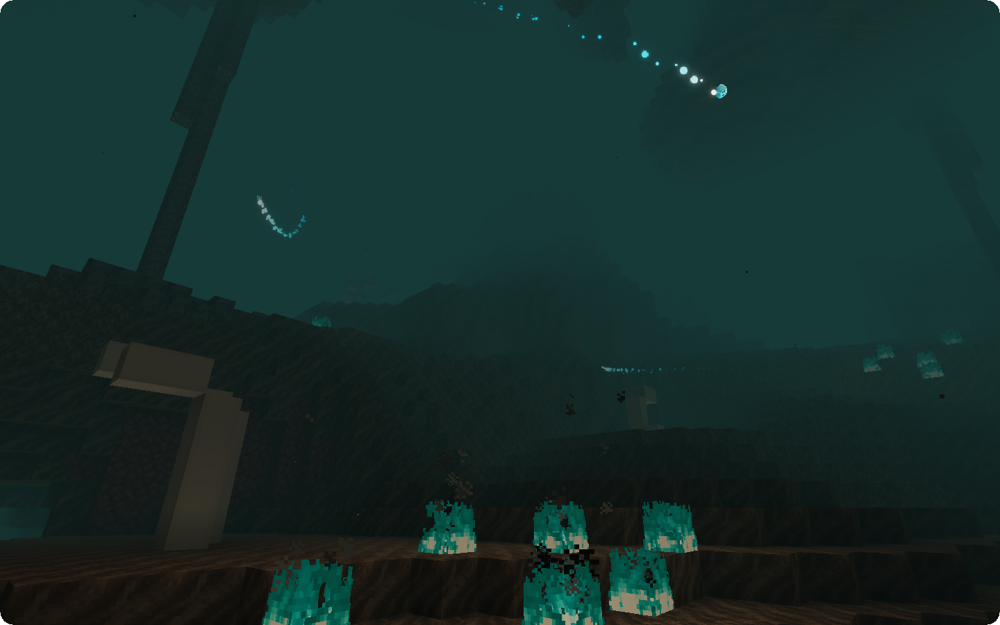
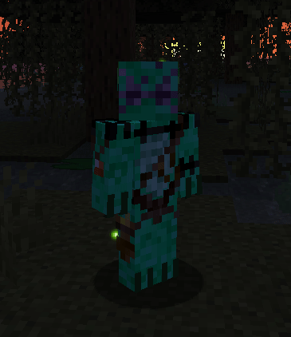
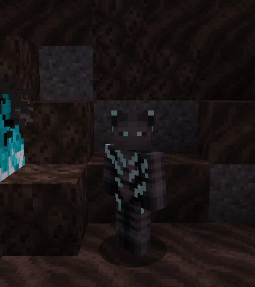
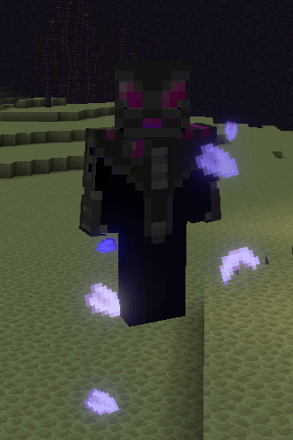
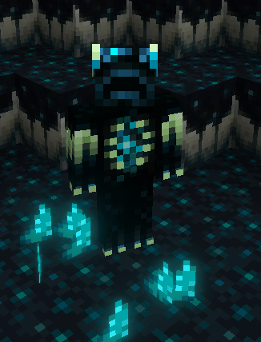
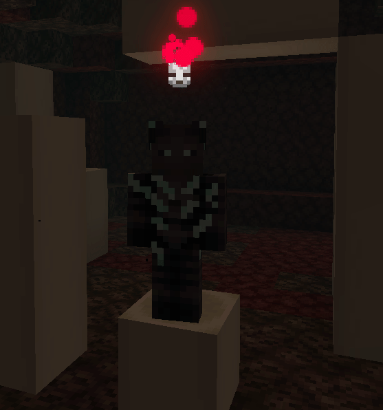
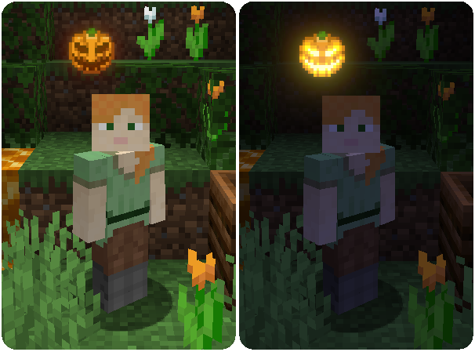

**Illuminations** is a client sided Minecraft Fabric mod that adds multiple ambient particles in order to make your world more enjoyable at night or in dark places.
This mod is compatible with the [Canvas Renderer](https://www.curseforge.com/minecraft/mc-mods/canvas-renderer).

*(All screenshots with a bloom effect were taken with Canvas Renderer installed)*

<iframe width="560" height="315" src="https://www.youtube.com/embed/OwmCX_COS8I" title="YouTube video player" frameborder="0" allow="accelerometer; autoplay; clipboard-write; encrypted-media; gyroscope; picture-in-picture" allowfullscreen></iframe>

## Ambience

### Overworld

#### Fireflies

**Fireflies** are small flying insects that **come out during the night** and disappear when the sun rises. They will appear in small quantities in jungle, plains, savanna and taiga type biomes, medium quantities in forest and river type biomes and great quantity in swamp type biomes.

#### Glowworms

**Glowworms** are small larvae living in **caves** by **sticking to the ceiling** that will fall down if their support block is removed. They will appear in small quantities in jungle, plains, savanna and taiga type biomes, medium quantities in forest and river type biomes and great quantity in swamp type biomes.

#### Glowing Plankton

**Glowing Plankton** - even though difficult to notice because of its size - can be found floating around in the **dark parts of the oceanic depths**. They appear in any ocean biome as long as the light is sufficiently low.

#### Prismarine Crystals

These beautiful glowing shards will **spawn around sea lanterns**, with more appearing in darker areas.

### Halloween Features

These spooky features only appear during the month of October by default.

#### Autumnflies

During the month of October, fireflies will adopt an orange tint instead of their regular green one.

#### Eyes in the Dark

Also during the month of October, you may come across **glowing eyes** in **absolutely dark spots**. These eyes will disappear if you come too close or if their darkness is disturbed by a light source.

#### Pumpkin Spirits

These mischievous entities take the form of **small flying Jack o'Lanterns** and will act like Will o' Wisps, appearing from **Jack o'Lanterns at night!**

#### Poltergeists

These **devious flying skulls** will appear from placed **skeleton skulls** at night and may also appear when you **kill undead at night!**

### Nether and End

#### Will o' Wisps

**Will o' Wisps** are rare small ghost-like creatures that appear in **Soul Sand Valleys**, flying through the air and phasing through Soul Sand. They also appear from **Soul Lanterns**, allowing the player to create a magical or eerie ambience by decorating their surroundings with those.

#### Chorus Petals

Appearing near **Chorus flowers**, these beautiful petals will twirl down to the ground, to the winds of the End, transitioning from a beautiful white to a majestic purple. The younger the flower is, the more petals will appear, and **breaking a Chorus flower** will provoke a **burst of petals** (again, the younger the flower, the more petals will burst).

## Special Features

### Jeb Easter Egg Expansion

*(Requires [Satin API](https://www.curseforge.com/minecraft/mc-mods/satin-api/), feature disabled with Canvas and Iris because of compatibility issues*)

Renaming any mob in the game to **jeb_** will apply a **rainbow effect** to it. This feature varies the colour values of the mobs and will work better on colourful mobs such as Creepers, Piglins and Shulkers and will barely make a difference on Skeletons or Wither Skeletons. However, even mobs with fewer colours will glow after being renamed.

## Cosmetics

In addition to the ambience changes, Illuminations also features **cosmetics**, primarily for those who **donated and contributed** to the project, with the exception of the **Pride Heart Collection** that is available for all [Accounts](https://doctor4t.ladysnake.org/register). Cosmetics can be switched and customised using the [Illuminations Dashboard](https://doctor4t.ladysnake.org/). Since Illuminations is client-side you can use these cosmetics even on servers. Other players with Illuminations will be able to see your cosmetics.

### Pride Hearts

Every Illuminations Account automatically has **free access** to these **11 spinning Pride Hearts** that will follow you as pets, hovering and spinning next to your head! More information [here](https://doctor4t.ladysnake.org/pride).

### Auras

#### Twilight Aura

The **Twilight aura** creates colored fireflies that will orbit around the player. The color of the fireflies can be changed to any color you want via the Illuminations dashboard. If the player moves, they will leave a trail of these fireflies. **This aura is available to tier 1 donators.**

#### Auras (Donator Tier 2)

#### Ghostly Aura

The **Ghostly Aura** will summon the lost souls to scamper around you!

#### Chorus Aura

The **Chorus Aura** makes you stand in a whirl of Chorus Petals, perfectly fit for your adventures in the end!

#### Prismarine Crystal Aura

The power of the Guardians is strong with you! I can feel it... or rather see:

#### Golden Rod Aura

This Aura will give you that extra bit of an ominous glint, summoning **Golden Rods** all around you!

#### Shadowbringer Soul Aura

This dark Aura will strike fear in your enemies as you are sourrounded by a storm of shady ashes!

#### Sculk Tendrils Aura

Are you excited for 1.18? This Aura will summon Tendrils from the **Deep Dark** to follow you and grow around your feet.

#### Autumn Leaves Aura

A **whirl of orange Leaves** following your footsteps to bring that cosy autumn feeling to your world!

#### Confetti Aura

This Aura will provide the perfect ambience for your celebrations. The **Confetti** pieces will stay on the ground for up to 20 seconds, marking your way through the world!

#### Prismatic Confetti Aura

A **variation** of the **Confetti Aura** that can be adjusted to only be of one colour of your choice.

### Overheads

**Overheads** are different hats that **tier 2 donators** can decide to wear:

### Pets

Other than the pride hearts **tier 2 donators** can also equip other pets that will hover next to them and look at what their owner is looking at.

#### Will o' Wisp

A lost soul that escaped the horrors of the Nether and is now searching for reve- for you? It seems to just want a new friend and not a bloody revenge.

#### Golden Wisp

You are going for the **shiny look**? In that case this pet might be the perfect match for your style, also looks great in combination with the [Golden Rod Aura](#golden-rod-aura)!

#### Dissolution Wisp

Classical **Dissolution Wisp**, for those who missed a friend...

#### Lanterns

These 4 different Lanterns are your friendly **2-faced companions that fly and spin next to you** to brighten your day! They are also perfect for watching your back.

#### Founding Skull

True villains always have some **true-villain-energy-pet**, so should you!

#### Poltergeist

A friendly and respectable companion, just don't expect much sleep at night, **Poltergeists** are said to be quite some noisy fellows!

#### Pumpkin Spirit

This adopted Spirit that once spawned from a Jack o'Lantern might look a little grim sometimes but it will not bite you - most of the time that is.

#### Jacko

Jacko is a Jack o'Lantern that will **light itself when it is night** or dark, **otherwise** it will be **extinguished**.

## Configurability

Illuminations possesses a few config options you can use to change how the mod behaves to better fit your needs.

They are split into general settings and biome specific customization. 

It is recommended to use [mod menu](https://www.curseforge.com/minecraft/mc-mods/modmenu) for the configuration, although it is possible to use the configuration files in your ".minecraft" folder too.

### General Settings

#### Halloween Features

Enables the different Halloween features being the **Eyes in the Dark**, the **Poltergeists** and the **Pumpkin Spirits**. ALWAYS will enable the features always while ENABLE will limit them to October.

**ENABLE**/DISABLE/ALWAYS

#### Eyes in the Dark Spawn Rate

Manages the rate at which the **Eyes in the Dark** spawn.

LOW/**MEDIUM**/HIGH

#### Will o' Wisp Spawn Rate

Manages the rate at which **Will o' Wisps** spawn.

LOW/**MEDIUM**/HIGH/DISABLE

#### Chorus Petals Spawn Multiplier

Sets a multiplier to control the amount of **Chorus Petals** spawning from Chorus Flowers.

0/**1**/2/.../9/10

#### Spawn Density

Controls the percentage of Illuminations spawns.

0(Disabled)/.../**100(normal)**/.../1000(10x)

#### Fireflies Spawn Always

Enables Fireflies to spawn at daytime.

Yes/**No**

#### Fireflies Spawn Underground

Enables Fireflies to spawn in caves.

Yes/**No**

#### Firefly White Alpha

Controls the alpha value of the white center glow for **Fireflies**, **Glowworms**, **Plankton** and **Twilight Aura fireflies**.

0(no white center)/**100(full alpha white center)**

#### Firefly RAINBOW Mode

If turned on, Fireflies are assigned an **individual random colour** on spawn.

Yes/**No**

#### Auto-Update

Once enabled the mod will **inform you about updates** on the title screen and **automatically update** itself on restart. Turned off by default to avoid confusion and compatibility issues.

Yes/**No**

#### See Cosmetics in First Person

Enables you to see your own **player cosmetics in First Person**. Turned off by default to avoid an obstructed view.

Yes/**No**

#### Display donation toast

Enables a small message on the title screen with a link to the illuminations donation page.

**Yes**/No

### Biome Settings

The Biome Settings allow you to customize the **Firefly Spawn Rate**, **Firefly Color**, **Glowworm Spawn Rate** and **Plankton Spawn Rate** for each biome category individually. You can find these settings in the different tabs in [mod menu](https://www.curseforge.com/minecraft/mc-mods/modmenu) (Overworld, Nether, End, Others) or in the configuration files.

## FAQ

#### Can I include this mod in a modpack?

**Yes**: You can. Go ahead, don't bother asking. Please however provide credit and a link to either the [GitHub repository](https://github.com/ladysnake/illuminations/) or [Curse Forge project page](https://www.curseforge.com/minecraft/mc-mods/illuminations).

#### Can you port this mod to forge? Can we get a version XY?

Sorry, we **don't** allow backports or ports to other modloaders for this mod.

#### Can I use this mod on a vanilla server?

**Yes**: If you have installed this mod on your Minecraft client, you will be able to connect to vanilla Minecraft servers and the ambient illuminations will work as intended.

#### Are auras visible to other players?

**Yes**: If the player has Illuminations installed on their client, your aura will be visible to them, just like their aura will be visible to you if they possess one.

#### How to get cosmetics?

Cosmetics are available to donators who donated at least 2$ on [ko-fi](https://ko-fi.com/doctor4t/shop) for tier 1 (Twilight Aura) and 7$ for tier 2.

#### I wish to support the mod and get an aura. What steps do I need to follow?

In order to get an aura, please **follow the instructions [here](https://doctor4t.ladysnake.org/donators).**

***Cosmetics only work on the up-to-date fabric versions of this mod!*** *The forge version is no longer maintained, some cosmetics might not work on older fabric versions.*

#### I want to change my aura / the color of my prismatic auras / disable it, what do I do?

If you have tier 2 cosmetics, you may have multiple cosmetics and may want to select a specific one. Or you may just simply want to change your prismatic color or disable a cosmetic. **You can do all this via the [Illuminations dashboard](https://doctor4t.ladysnake.org)** with no restrictions whatsoever.

## Gallery

