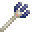

**Impaled** is a fabric mod adding a few new tridents to the game and reworking some of the mechanics revolving around them. This mod features compatibility with the [Canvas Renderer](https://www.curseforge.com/minecraft/mc-mods/canvas-renderer).

<iframe width="560" height="315" src="https://www.youtube.com/embed/9JhblcRTRu8" title="YouTube video player" frameborder="0" allow="accelerometer; autoplay; clipboard-write; encrypted-media; gyroscope; picture-in-picture" allowfullscreen></iframe>

## Features

### Mechanics

Impaled changes, fixes and adds a few features for tridents:

 
#### Impaling

Impaling now **deals damage to wet mobs** (underwater or in rain) instead of aquatic mobs only.
To balance this change, Impaling only increases the damage by 0.75 per level instead of 1.25.

 
#### Loyalty

Tridents with the Loyalty enchantment will **always return to the inventory slot they were launched from**, including the Offhand.
Should the player pick up new items blocking said slot, the trident will return to a free slot just as usual.

 
#### Sincere Loyalty

Impaled also adds a **new level to Loyalty**, Sincere Loyalty or Loyalty IV, giving you the ability to **retain your Trident from anywhere in the world** by holding down the right mouse button with an empty slot selected.
Tridents with Sincere Loyalty will drop as entity instead of as an item when dropped and will even return to you when in another player's inventory.

In addition to that, Tridents with Sincere Loyalty **can be enchanted with Riptide**.

Sincere Loyalty can be obtained by combining a Loyalty III-Trident with a **Heart of the Sea** in a **Smithing Table**.

 
 
### Tridents

Impaled adds a total of 5 new tridents with unique behavior:

 
####  Pitchfork

The Pitchfork is an **early-game version of the Trident**. It has reduced durability compared to the actual Trident and does not work properly underwater.
Nonetheless it can be thrown and used in melee combat, enchanted with all the Trident-Enchantments and even be used to convert Dirt to Farmland.

The Pitchfork can be crafted using 3 Iron Bars and 2 Sticks:

 

 
####  Elder Trident

This Trident uses ancient Guardian magic to home for mobs if it does not hit its target first time.
It will also store the items dropped by killed mobs and give them to the player when being picked up or retrieved with Loyalty. 

Using **Riptide on an Elder Trident** will create 1 Guardian Trident per Riptide level that will copy the Elder Trident's trajectory and behavior of homing for mobs and returning items.

Hitting something with a **Channeling**-Elder Trident will, even outside of thunderstorms, cast Mining Fatigue on the target for 10 seconds.
Thunderstrikes can still be summoned during thunderstorms.

An Elder Trident is obtained by **combining a normal Trident with an Elder Guardian Eye** in the Smithing Table.
Elder Guardian Eyes are dropped by Elder Guardians killed using a Trident in a melee attack or a Loyalty III/IV-Trident.

 

 
####  Hellfork

The Hellfork is the Trident of the Nether, being invulnerable to lava and fire just like Netherite, having increased durability and setting mobs on fire.

**Riptide-Hellforks** are based on fire instead of water, meaning the player needs to be in lava or burning for it to work.
It will however unharmfully and invisibly set users on fire while using Riptide, meaning the player can chain dashes once in the sky.

**Impaling-Hellforks** deal 1 more damage to fire resistant mobs (Magma Cubes, Ghasts,..) per level instead of wet mobs.
This also works for targets with the Fire Resistance buff such as players or Witches.

To obtain a Hellfork, **combine a Trident and an Ancient Trident** in a Smithing Table.
Ancient Tridents are immune to fire and lava and can be found in Treasure Bastion Remnants with a 60% chance.

 
####  Soulfork variant

A **Hellfork can absorb Soul Lanterns, Soul Campfires or Soul Torches**, making it a Soulfork.
This process will turn the used block into its normal variant (for example make the Soul Campfire a Campfire) and is **reversible**.

**Soulforks with Riptide** can be used at any time at the cost of 1 level of experience or, in case the player runs out of experience, 1 heart of health.
Using Riptide will also put the player on fire without hurting them (as long as they were not on fire before).

 

 
####  Atlan

The Atlan is a golden Trident with a **high enchantability**. It accepts not only Trident-Enchantments but also **all Sword-Enchantments** like Fire Aspect, Sweeping Edge or Smite.

The Atlan is obtained by **combining an Enchanted Golden Apple with a Trident** in a Smithing Table.

 

 
 
### Experimental

 

####  Maelstrom

The Maelstrom is a creative-only item which allows you to launch Tridents from your inventory without charging time but instead a cooldown afterwards, allowing for a faster reaction time and better handling of multiple tridents.

It can be enchanted with Unbreaking, Mending and Efficiency, the latter to reduce its cooldown.

 
 
## FAQ

#### Can I include this mod in a modpack?

**Yes**, you can. Go ahead, don't bother asking. Please  however provide credit and a link to both the [GitHub repository](https://github.com/Ladysnake/Impaled) and [Curse Forge project page](https://www.curseforge.com/minecraft/mc-mods/Impaled).

#### Will you be making a Forge version? Does a Forge version exist?

**No**, we will not be making a Forge version of this mod.
 

## Gallery

