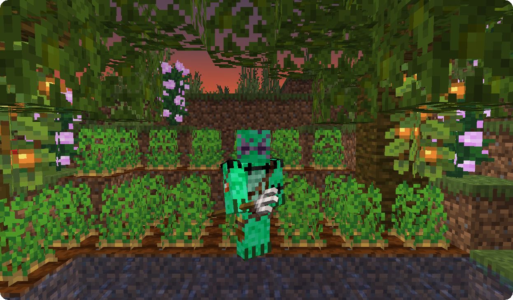
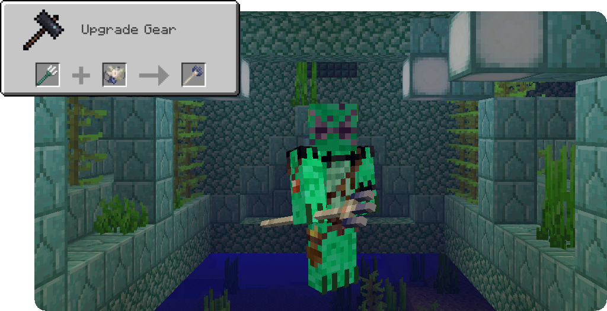
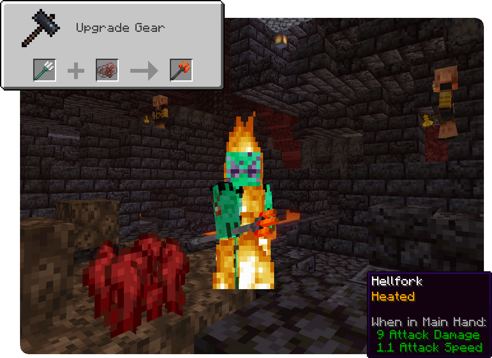
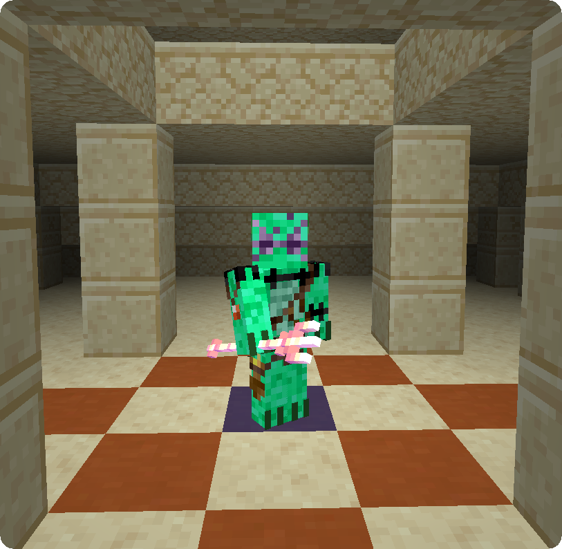
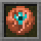

**Impaled** is a fabric 1.17 mod that adds a few new tridents to the game and reworks some of the mechanics revolving around them. This mod is compatible with the [Canvas Renderer](https://www.curseforge.com/minecraft/mc-mods/canvas-renderer).

<iframe width="560" height="315" src="https://www.youtube.com/embed/9JhblcRTRu8" title="YouTube video player" frameborder="0" allow="accelerometer; autoplay; clipboard-write; encrypted-media; gyroscope; picture-in-picture" allowfullscreen></iframe>

## Features

### Mechanics

Impaled changes, fixes and adds a few features for tridents:

#### Impaling

Impaling now deals damage to mobs that are wet (underwater or in rain) instead of aquatic mobs. To balance this change Impaling only increases the damage by 0.75 per level instead of 1.25.

#### Loyalty

Tridents with the Loyalty enchantment will always return to the inventory slot they were launched from, including the Offhand. If the player picks up new items blocking said slot, the trident will return to a free slot just as usual.

#### Sincere Loyalty

This mod also adds a new level to Loyalty, Sincere Loyalty or Loyalty IV, giving you the ability to retain your Trident from anywhere in the world by right-clicking with an empty slot. Tridents with Sincere Loyalty will drop as entity instead of as an item in any situation and will even return to you when in another player's inventory. In addition to that, Tridents with Sincere Loyalty can be enchanted with Riptide.

##### Obtaining

Sincere Loyalty can be obtained by combining a Loyalty III-Trident with a Heart of the Sea in a Smithing Table.

{: .wiki}

### Tridents

There are 4 new Tridents added by Impaled:

#### Pitchfork

The Pitchfork is an early-game version of the Trident. It has reduced durability compared to the actual Trident and does not work properly underwater. Nonetheless it can be thrown and used in melee combat, enchanted with all the Trident-Enchantments and even be used to convert dirt to farmland.

##### Obtaining

The Pitchfork can be crafted using 3 Iron Bars and 2 Sticks:

{: .wiki}

#### Elder Trident

This Trident uses the ancient Guardian magic to home for mobs if it does not hit its target first time. It will also store the items dropped by killed mobs and give them to the player when being picked up or retrieved with Loyalty. 

If a Riptide-Elder Trident is used it will create 1 Guardian Trident per Riptide level that will copy the Elder Trident's behavior of homing for mobs and returning items.

In addition to the normal behaviour of Channelling during storms, hitting a player with an Elder Trident will affect them like an Elder Guardian, appearing before them and affecting them with Mining Fatigue. This feature is, unlike the thunderstrike, not limited to thunderstorms.

##### Obtaining

And Elder Trident is obtained by combining a normal Trident with an Elder Guardian Eye in the Smithing Table. Elder Guardian Eyes are obtained by killing an Elder Guardian using a Trident in a melee attack or a Loyalty III- or Loyalty IV-Trident.

{: .wiki}

#### Hellfork

The Hellfork is the Trident of the Nether, being invulnerable to lava and fire just as Netherite, having increased durability and setting mobs on fire.

Riptide-Hellforks are based on fire instead of water: To use Riptide the player needs to be in lava or on fire. But the Trident can be heated to ignite the user while holding it by using it on a lava cauldron, enabling the owner to fly as long as it does not rain or the player lands in water. To cool the Trident down it can be used on a water cauldron or a powdered snow cauldron.

Impaling-Hellforks deal 1 more damage to fire resistant mobs (Magma Cubes, Ghasts,..) per level, including those with the Fire Resistance Effect (Witches), instead of wet mobs.

##### Obtaining

To obtain a Hellfork, combine a Trident and an Ancient Trident in a Smithing Table. Ancient Tridents are immune to fire and lava and can be found in Treasure Bastion Remnants with a 60% chance.

{: .wiki}

#### Atlan

The Atlan is a golden Trident with a high enchantability. It accepts not only Trident-Enchantments but also all Sword-Enchantments like Fire Aspect, Sweeping Edge or Smite.

##### Obtaining

The Atlan is obtained by combining an Enchanted Golden Apple with a Trident in a Smithing Table.

{: .wiki}

### Experimental

#### Maelstrom

The Maelstrom is an (currently creative-only) item that allows you to launch Tridents from your inventory without charging time but instead a cooldown afterwards, allowing for faster reactions. It can be enchanted with Unbreaking, Mending and Efficiency, the latter to reduce the cooldown.

{: .wiki}

## FAQ

#### Can I include this mod in a modpack?

**Yes**, you can. Go ahead, don't bother asking. Please  however provide credit and a link to both the GitHub repository and  Curse Forge project page.

#### Will you be making a Forge version? Does a Forge version exist?

**No**, we will not be making a Forge version of this mod. We do welcome third-party ports however, so feel free to [come chat with us](https://ladysnake.glitch.me) about it if you feel like doing one.

## Gallery

{: .wiki}

{: .wiki}

{: .wiki}
