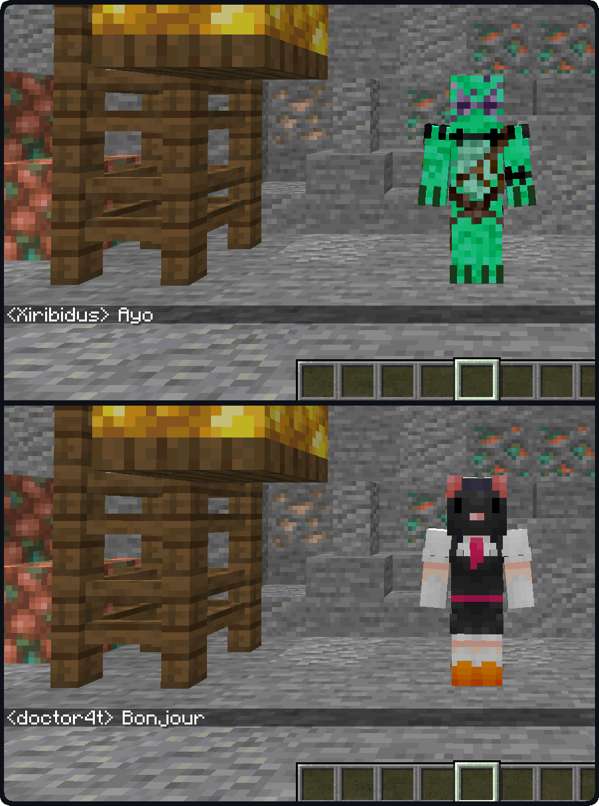

Have you ever wanted to impersonate another player ? Be it for making machinimas, roleplaying, playing 5D chess in factions, or just pranking friends, there are lots of (relatively) good reasons to assume the identity of someone else.

## Features
Impersonate allows players to take on the name and appearance of other players. When impersonating someone, a player
will:

- have the skin of the impersonated player  
- have the nameplate of the impersonated player  
- send every chat message as if they were the impersonated player  
- appear as the impersonated players in online player lists, if the impersonated player is online both will be shown as them separately
- sign books as if they were the impersonated player  
- etc. 

They will however not fool the impersonated player's pets, if any.

To avoid moderation chaos, server logs will always display the actual player's name, alongside their fake identity. Server operators will have ongoing impersonations revealed in the same way.

{: .wiki}

### Commands  
Impersonate adds the `/impersonate` command, allowing server operators and mapmakers to interact with the API through
commands.  
- `/impersonate disguise`  
    - `/impersonate disguise as <name> [<targets>] [<key>]` : disguises one or more players  
        - `<name>` : Name of the player to impersonate. Does not have to be online or even real.  
        - `[<targets>]` (optional) : If specified, must be either a player's username or a target selector. If unspecified, defaults to the player using the command. When used in a command block, `[<targets>]` is not optional.  
        - `[<key>]` (optional) : If specified, must be a valid identifier serving as a key for the impersonation.  
    - `/impersonate disguise clear [<targets>] [<key>]` : stops the impersonation of one or more players  
        - `[<targets>]` (optional) : If specified, must be either a player's username or a target selector. If unspecified, defaults to the player using the command. When used in a command block, `[<targets>]` is not optional.  
        - `[<key>]` (optional) : If specified, must be a valid identifier that was previously used as a key to start an impersonation. If left unspecified, the command will clear every active impersonation.
  - `/impersonate disguise query [<target>] [<key>]` : queries the ongoing impersonation for a given player.
      - `[<target>]` (optional) : If specified, must be either a player's username or a target selector. If unspecified, defaults to the player using the command. When used in a command block, player is not optional.
      - `[<key>]` (optional) : If specified, must be a valid identifier. In that case, the command will display the specific impersonation using that key, otherwise it will display the currently visible (most recent) impersonation.

### Gamerules
- `impersonate:fakeCapes` : Whether impersonators should get the cape and elytra of impersonated players. Defaults to `false`.  If [Illuminations](illuminations) is installed, the gamerule also applies to player cosmetics.
- `impersonate:opRevealImpersonations` : Whether ongoing impersonations should be revealed to online server operators. Defaults to `true`.  
- `impersonate:logRevealImpersonations` : Whether ongoing impersonations should be revealed in the server logs. Defaults to `true`.  

## Using Impersonate (for developers)

If you are a developer, you can use Impersonate as a library for your own project by inserting the following in your `build.gradle` :

```gradle
repositories {
	maven { 
        name = "Ladysnake Mods"
        url = "https://maven.ladysnake.org/releases"
        content {
            includeGroup 'io.github.ladysnake'
            includeGroupByRegex 'io\\.github\\.onyxstudios.*'
        }
    }
    maven {
        name = "Nexus Repository Manager"
        url = 'https://oss.sonatype.org/content/repositories/snapshots'
    }
}

dependencies {
    modImplementation "io.github.ladysnake:Impersonate:${impersonate_version}"
    include "io.github.ladysnake:Impersonate:${impersonate_version}"
    // Impersonate dependencies
    include "me.lucko:fabric-permissions-api:${fpa_version}"
    include "com.github.onyxstudios.Cardinal-Components-API:cardinal-components-base:${cca_version}"
    include "com.github.onyxstudios.Cardinal-Components-API:cardinal-components-entity:${cca_version}"
}
```

You can then add the library version to your `gradle.properties`file:

```properties
# Impersonate
impersonate_version = 1.x.y
# Fabric Permissions API
fpa_version = 0.1-SNAPSHOT
# Cardinal Components
cca_version = 2.x.y
```

You can find the current version of Impersonate in the [releases](https://github.com/Ladysnake/Impersonate/releases) tab of the repository on Github,
and the latest CCA version in the [appropriate repository](https://github.com/OnyxStudios/Cardinal-Components-API/releases). 

### Example code

You can find examples in the [Test Mod](https://github.com/Ladysnake/Impersonate/tree/master/src/testmod/java/io/github/ladysnake/impersonatest)
and in the [Impersonate Command](https://github.com/Ladysnake/Impersonate/blob/master/src/main/java/io/github/ladysnake/impersonate/impl/ImpersonateCommand.java).

```java
public static final Identifier IMPERSONATION_KEY = new Identifier("mymod", "impersonitem");

public boolean useOnEntity(ItemStack stack, PlayerEntity user, LivingEntity entity, Hand hand) {
    if (entity instanceof ServerPlayerEntity) {
        Impersonator.get(user).impersonate(IMPERSONATION_KEY, ((PlayerEntity) entity).getGameProfile());
    } else {
        Impersonator.get(user).stopImpersonation(IMPERSONATION_KEY);
    }
    return super.useOnEntity(stack, user, entity, hand);
}
```
