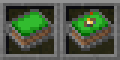
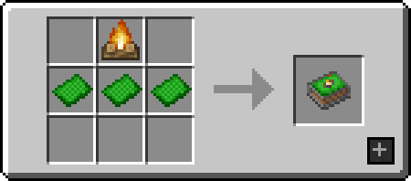
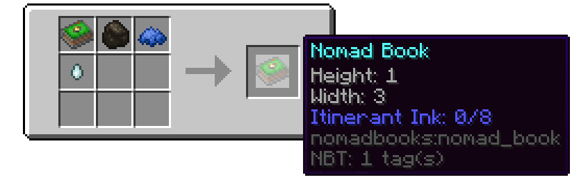
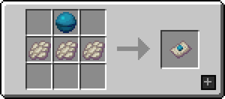
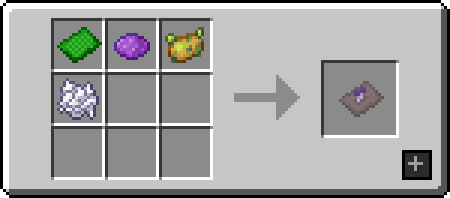
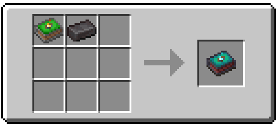

**Nomad Books** is a Minecraft Fabric mod that introduces a solution for players that are always adventuring around their world. Nomad books allow these players to store their camp in form of an item and redeploy it 
whenever and wherever they wish.

## Features

### Nomad Books

A nomad book is an item that can store a 3x1x3 sized camp. The book displays a campfire as indicator if the camp is deployed (campfire absent) or not (campfire visible).

{: .wiki}

To **deploy** a camp simply find a flat spot with sufficient space blocked by nothing but plants (grass, flowers, vines,...) and snow and use the nomad book where you want the centre of your camp to be.

To **retrieve** a camp the player needs to be in a 10 block radius to the centre and use the book again. If you are too far away from the camp to retrieve it you can hold enderpearls in your offhand while using the book to teleport back to the centre of the camp at the cost of one enderpearl per 60 blocks of distance travelled.

Shift-using with the nomad books will reveal the boundaries of the camp.

{: .wiki}

Default camp setup with boundaries toggled on.

### Obtaining

#### Nomad Books

Nomad Books can be crafted using three grass pages and a campfire.

{: .wiki}

There will always be a Nomad Book appearing in the bonus chest (if enabled) at the start of the game.

#### Grass Pages

Grass pages - which allow the player to craft and upgrade nomad books - can be found with a **50%** chance in the **loot chests** of buried treasures, cartographer villagers,  dungeons, jungle temples, mineshafts and pillager outposts.

They can also be found in **stronghold library chests** in stacks of **0-3**.

Another way of obtaining grass pages is by **dismantling Nomad Books** in a crafting grid while the camp is deployed. For dismantling a Nomad Book the player will receive 3 grass pages for the book itself, 1 page per height upgrade and 2 pages per width upgrade as well as 1 page per special upgrade.

### Upgrading

Upgrades to the book can only be done while the camp is undeployed.

##### Height

A book's height can be upgraded by shapelessly **combining it with grass pages** in a crafting inventory. Despite there being no limit to the height of a camp, the higher it gets the more difficult the search for a good spot may be since not only space that is actually used must be emptied of obstacles.

##### Width

A book's width can be upgraded by using itinerant ink. **Itinerant ink** can be applied to a book by shapelessly combining it with a ghast tear, blue dye and charcoal.

Upon application, a goal will be decided depending on the current width size. Progress towards this goal is made by visiting biomes that the book hasn't been to yet. Note that it does **not** have to be a new **kind** of biome.

{: .wiki}

#### Special Upgrades

Special upgrades are upgrades that only have to be applied once to a book and add special properties to itself or the camp. Upgrades are applied by combining the book with a specific item in a crafting grid.

##### Aquatic Membrane Page

The Aquatic Membrane page (crafted as seen below) adds a membrane to your camp that will stop fluids from entering but lets the player as well as other entities pass, opening up the possibility to place your camp underwater!

{: .wiki}

##### Mycelium Page

The Mycelium Page is a special page granting the Fungi Support upgrade. Fungi support allows the camp to be deployed on rough surfaces, as long as no obstacles interfere, by growing a special mushroom to fill up the missing floor blocks.

{: .wiki}

##### Nether Nomad Book

By combining the Nomad Book with a netherite ingot in an usual crafting grid the dropped item won't be destroyed in lava and instead swims up in it, similar to netherite ingots, tools and armour.

{: .wiki}

## FAQ

#### Can I include this mod in a modpack?

**Yes**, you can. Go ahead, don't bother asking. Please  however provide credit and a link to both the GitHub repository and  Curse Forge project page.

#### Will you be making a Forge version? Does a Forge version exist?

**No**, we will not be making a Forge version of this mod. We do welcome third-party ports however, so feel free to [come chat with us](https://ladysnake.glitch.me) about it if you feel like doing one.

## Gallery

{: .wiki}

{: .wiki}

{: .wiki}
