---

layout: wiki
title: Pick Your Poison
slug: pick-your-poison
curse_project: 596706
---

Pick Your Poison is a Minecraft fabric mod bringing poison dart frogs and 6 new effects to the game!

<iframe width="560" height="315" src="https://www.youtube.com/embed/6fby-ANNjVw" title="YouTube video player" frameborder="0" allow="accelerometer; autoplay; clipboard-write; encrypted-media; gyroscope; picture-in-picture" allowfullscreen></iframe>

## Poison Dart Frogs

Poison Dart Frogs can be found spawning in 7 different types in the **various jungle variants**. They can be **picked up by using a bowl** on them and will give the player their **respective effect when hit or licked**.

Licking a Poison Dart Frog can be done by **"eating" the picked up version** and will not consume the frog. You can **not lick** a Poison Dart Frog **while you have its effect** and the frogs themselves are immune to their effects.

Putting a picked up Poison Dart Frog back down requires **sneaking while right-clicking**.

### Advancements

Pick Your Poison features 2 special advancements:

- **Taste Test** - Lick a poison dart frog in a bowl

   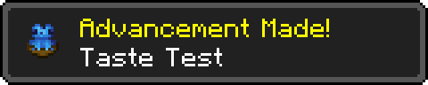

- **Taste The Rainbow** - Wait... Those aren't Skittles! *(Have all poison dart frog effects at a time, does not include the [Luxalamander](#-luxalamander))*

   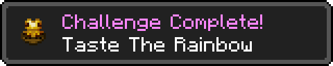

  

### Poison Dart Frog types

#### 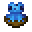 Blue

Blue Poison Dart Frogs give the **Comatose** effect for **20 seconds**.

##### Comatose

Comatose **renders the player unable to see or do anything**, including pausing the game or opening the inventory **until the effect runs out or the player is attacked**. Being a regenerative sleep however, Comatose will cause the player to **gain back some health** while under the effect. Additionally, the **first damage** received by a comatosed player **will be negated**.

#### 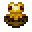 Golden 

Golden Poison Dart Frogs will apply the **Batrachotoxin** effect for **30 seconds**.

##### Batrachotoxin

Batrachotoxin is a **stronger version of the vanilla poison, ignoring armor enchantments** such as protection.

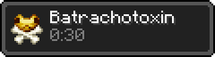

#### 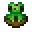 Green

Green Poison Dart Frogs apply the **Numbness** effect for **20 seconds**.

##### Numbness

Numbness **prevents the player from taking any damage** while the effect lasts. Instead, **the damage is applied all at once as soon as the effect runs out**. This cannot be bypassed using milk or commands.

#### 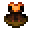 Orange

Orange Poison Dart Frogs will give the **Vulnerability** effect for **30 seconds**.

##### Vulnerability

Being the counterpart to Resistance, players will **suffer increased damage** while under the Vulnerability effect.

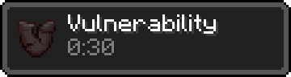

#### 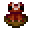 Crimson

Crimson Poison Dart Frogs give the **Torpor** effect for **30 seconds**.

##### Torpor

Torpor **blocks all health regeneration** but slowly **refills the hunger bar** while the effect lasts.

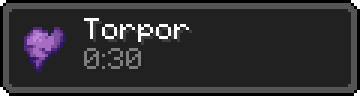

#### 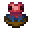 Red

Red Poison Dart Frogs will apply the **Stimulation** effect for **20 seconds**.

##### Stimulation

Stimulation gives a **speed boost and removes the limit of only being able to sprint with 3 or more hunger points**. Instead, losing hunger while having the Stimulation effect will result in taking damage. **Players will take 1 heart of damage each time half a hunger point is lost.**

#### 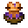 Luxalamander

The Luxalamander is a rare frog type appearing only **once in 100 spawns** and referencing the main texture artist for this mod, **Luxintrus**. Licking or hitting this Poison Dart Frog will anger it into punching your eyes and inflict **Blindness for 1 minute**. For some mysterious reason, the Blindness effect can also be applied to a [poison dart](#poison-darts).

#### 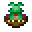 Rana Frog

The Rana Frog is a special frog type only obtainable by **renaming another Poison Dart Frog to "Rana"** using a Name Tag. It does **not have a poison** and **no Throwing Darts** can be coated using this frog. Also note it can not be converted back to a normal Poison Dart Frog.

## Throwing Darts

Throwing Darts can be **crafted in a bunch of 4 using 1 Iron Nugget, 1 Bamboo and 1 Feather**. They can be stacked and thrown by hand, **dealing as much damage and knockback as a fist punch**. When used on a placed down frog they will be **imbued with the respective poison**, applying it to hit targets for a few seconds. Imbued Poison Darts are not stackable.

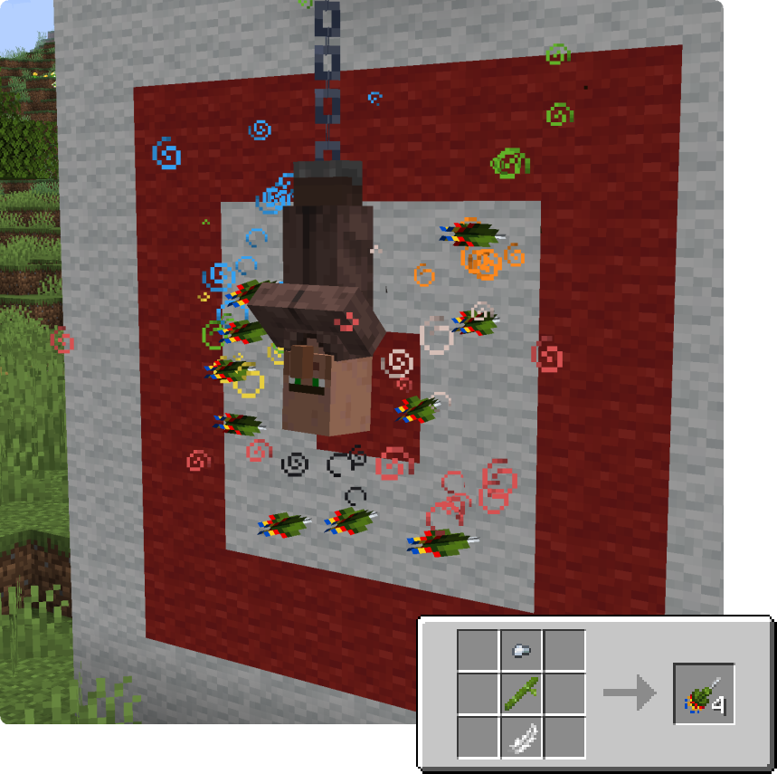

### Poison Darts

 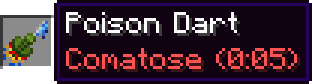 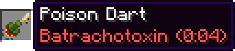

 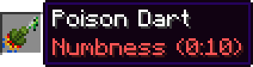 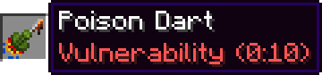

 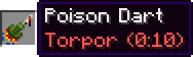  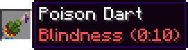 

 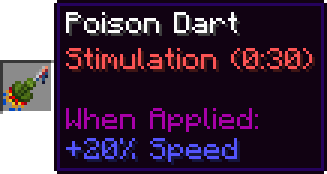

## Supporter Features

Players [that **support** the mod](https://ko-fi.com/s/c3991a73b3) can **wear the Poison Dart Frog bowls on their head to display the respective frog type**. Consider installing [the **Trinkets** mod](https://www.curseforge.com/minecraft/mc-mods/trinkets-fabric) for an additional slot. More info can be found [**here**](https://doctor4t.uuid.gg/donators).

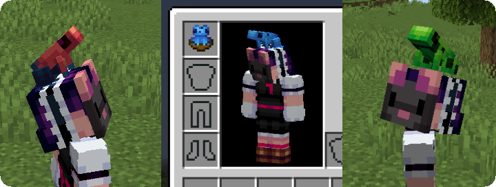
