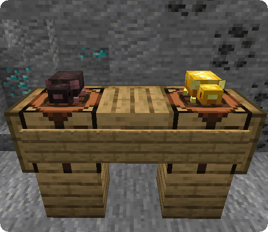
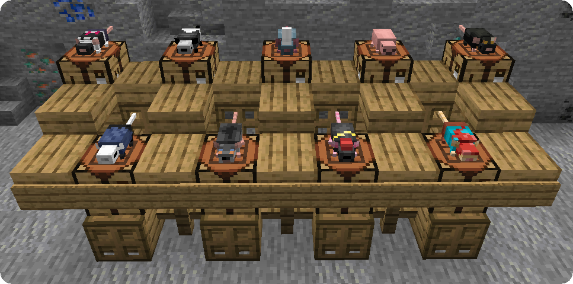
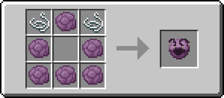
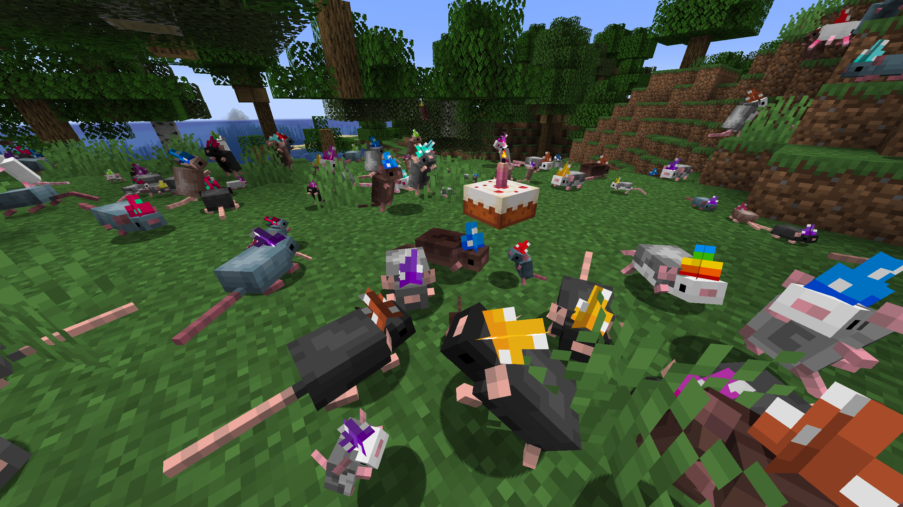

**Rat's Mischief** is a Fabric mod, introducing the rats, a new mob that can be tamed and interacted with in various different ways!

## Video Showcase

<iframe width="560" height="315" src="https://www.youtube.com/embed/CVZfsPM8Mm4" title="YouTube video player" frameborder="0" allow="accelerometer; autoplay; clipboard-write; encrypted-media; gyroscope; picture-in-picture" allowfullscreen></iframe>

## Features

### Rats

Rats can be found in previously inhabited villages that are now abandoned. Once a natural village no longer has tenants, rats will start spawning in small groups of up to 5 rats if a player is near that empty village and the village still has beds.

#### Behaviours

Rats will behave in a very similar manner to wolves, attacking what the player targets or what harms the player or themselves. They have 8 health points (4 hearts) and deal 1 point of damage but ignore invulnerability ticks, making a mischief stronger the bigger it becomes.
Rats take fall damage starting from 15 blocks, can breathe five times longer than the player, ignore damage from cacti and berry bushes and can be tamed with any food, the better the food though, the higher the chance of success. Once tamed you will be able to sit them down and or let them follow you. If they see a cat while following you around they will be distracted chasing it away.

Rats will pick up any item stack on the floor they come across, and bring it back to their owner if they are tamed. If they are hurt and the item is edible, they will consume it and restore an amount of health equivalent to the amount of saturation the food gives as well as apply any effects the food provides. No matter their state, if rats come across a drinkable potion, they will consume it and get its effects and, once again, convert saturation to regeneration.

### Special Events

#### World Rat Day

On April 4th, World Rat Day, all rats will smug dance and the chance of golden rats spawning increases from 1 in 150 to 1 in 30!

#### Rat's Mischief's Birthday

On December 28th, wild adult rats will have a 20% chance to be of a fully random type (including special types) as well as a 20% chance on spawning with a cake in their paws to celebrate the birthday of the mod itself! Rats will also smug dance during this special week and wear randomized party hats.

#### RAT's Birthday

On the 19th of July, RAT's (doctor4t) birthday, as well as during the following week rats will smug dance, wear party hats and have a 20% chance to spawn with a cake if they are spawned as adults. Additionally, there will be a chance of 10% for wild rats to spawn as the doctor4t type.

### Types

##### Natural Rat Types

Naturally spawning rats will always be either a Wild Rat or a Golden Rat.

- **Wild Rat**
- **Golden Rat** (spawn chance of 1 in 150)

 

##### Pet Rat Types

Pet rats can be obtained by breeding wild rats. Their offsprings will then be 1 of the 7 pet rat types:

- **Albine**
- **Grey**
- **Husky**
- **Russian Blue**
- **Light Brown**
- **Chocolate**
- **Black**

##### Special Rat Types

Renaming rats with the following names will give them a new, special appearance both with and without [elytrat](#elytrats).

- **doctor4t** (mod creator)

- **Arathain** (texture artist)

- **Astron/Astronyu** (artist)

- **Remy** (Ratatouille)

- **Ratater** (Botania)

- **Jorato** (JoJo's Bizarre Adventure)

- **Hollow Rat** (Hollow Knight)

- **Jerma** (Jermas Rat Movie)

- **Biggie Cheese**

- **Rateline** (Madeline, Celeste)

- **Rat Kid** (A Hat in Time)

  Rat Kids are a special rat type as they can be dyed just like sheep in order to variate their skins, resulting in 16 different versions. Breeding 2 Rat Kids will also spawn a new, unnamed Rat Kid instead of a normal pet rat.

 

### Elytrats

Elytrats are a special rat variant, acquired by equipping rats with the elytrat item, crafted as shown below. Equip/unequip a rat by simply shift-using the rat with the elytrat/bare fist. Normal rats will also equip elytrats upon picking them up from the floor.

Elytrats can and will fly to attack enemies and to follow you on your airborne adventures! Just as any other rat they can be picked up with rat pouches. Elytrats also feature custom elytra textures for special rat variants and the golden rat.

### Accessories

#### Staves

When appearing naturally in an empty village or being bred, rats have a 5% chance to spawn with staves in their possession. These staves can be obtained by taming the rats possessing them if they aren't already and are useful to make the rats perform specific tasks. Each staff use orders the rats to execute the corresponding order for 15 seconds, items acquired by the rats will be brought to you and required items can be dropped on the floor for them.

- **Harvest Staff:** Rats harvest any mature crop and replant any cultivatable item on farmland tiles. If given Bone Meal, they will also fertilize crops!
- **Love Staff:** Rats breed all the animals around them (including themselves) as long as they have the corresponding food.
- **Collection Staff:** Can be used on blocks to make rats break the corresponding material they come across. Rats can break blocks with a hardness of 1 plus 1 per level of strength that is applied to them. Haste effects boost their mining speed by 20% per level of haste. This order is cancelled by using the staff on the air.

#### Rat Pouches

Rat pouches can be used to quickly gather rats back. Using a pouch on a rat will put that rat inside the pouch. Shift-using an empty rat pouch will gather all rats that the pouch can hold in a 16 block radius. Shift-using a filled rat pouch releases all rats inside it.

Pouches can be crafted like bundles with leather, twisted vines and popped chorus fruit, to produce respectively pouches with a capacity of 5, 10 and 20 rats.
Rats stored in Pouches won't age, meaning they will keep status effects, health, their variant and names.

#### Mask of Rat

Obtained by either purchasing it for 40 emeralds from a wandering trader, breeding rats and succeeding on a 0.5% chance of a baby rat wearing it or killing doctor4t on a multiplayer server, this item has a protection value of just one armor bar but the enchantibility of gold.

The person wearing this mask will not be able to harm wild or tamed rats and all their status effects as well as the armor and enchantments of the mask will be provided to all tamed rats. This includes positive and negative status effects such as invisibility and hunger.

This item can be repaired in an anvil using phantom membranes.

## FAQ

#### Can I include this mod in a modpack?

**Yes**: You can. Go  ahead, don't bother asking. Please however provide credit and a link to  either the GitHub repository or Curse Forge project page.

#### ISN'T THis jUST a RAtS rIp-OFF??

**No**: I have no ties  with Rats, and this mod is a completely different one with a completely different vision. Rats are amazing creatures, and I'm not of a fan of  how "modded" "Rats" looks and feels, so I went with a more summoner styled approach as well as aiming to feel Vanilla+. The two mods differ hugely, and I didn't draw any inspiration from "Rats" as I never played  it and only ever heard of it and the memes. This isn't a Fabric version of "Rats", nor is this a rip-off. 

#### Can you port to Forge please? Backport to version X?

We don't port our mods to forge or backport them for various reasons. If you want to make a port yourself however feel free to contact us!

## Gallery

<blockquote class="twitter-tweet">
It ain&#39;t much but it&#39;s honest work <a href="https://t.co/vILMVJ3mBn">pic.twitter.com/vILMVJ3mBn</a>
&mdash; RAT (@doctor4t_) <a href="https://twitter.com/doctor4t_/status/1358888046435958791?ref_src=twsrc%5Etfw">February 8, 2021</a></blockquote>
<blockquote class="twitter-tweet">
Rats make fine herbalists too! <a href="https://t.co/OxESLzNmhX">pic.twitter.com/OxESLzNmhX</a>
&mdash; RAT (@doctor4t_) <a href="https://twitter.com/doctor4t_/status/1359138165672583169?ref_src=twsrc%5Etfw">February 9, 2021</a></blockquote>

