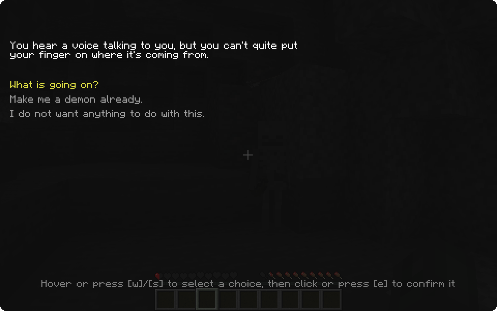
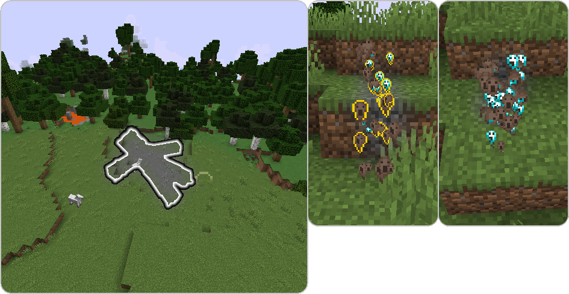
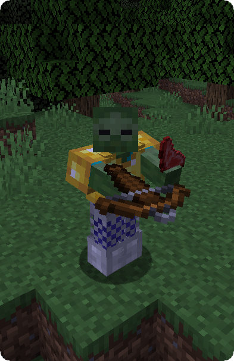
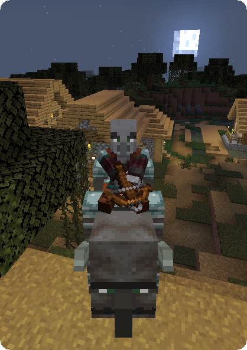
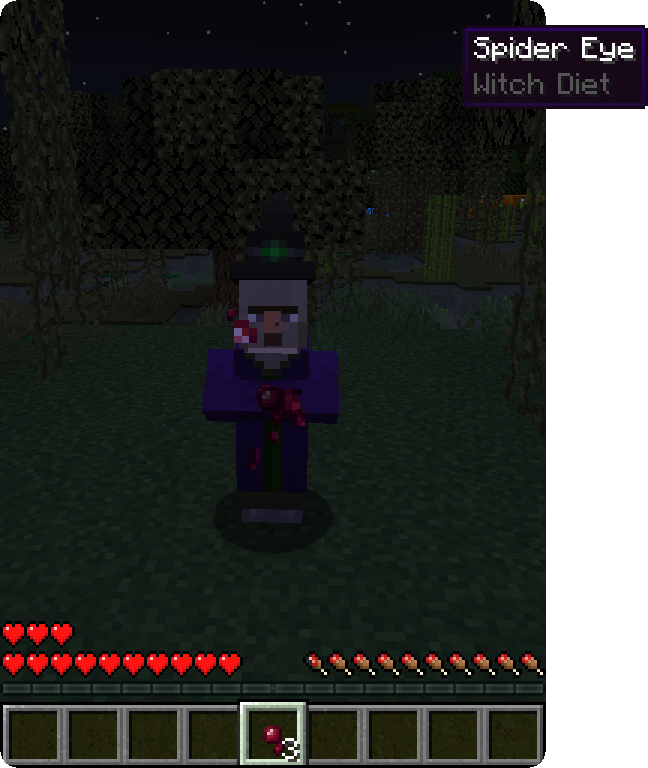
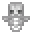

## First Death

Upon dying for the first time in a world, a **dialogue** will be prompted to the player. In this menu, the
player can select **whether or not they want to become a demon**, and **activate the mod for themselves or not**.
After choosing, the player obtains the "A Devilish Conundrum" and **the dialogue will not be prompted anymore**.
However, the player can still **change their mind** by using the [**Mortician's conversion trade**](mortician#conversion-trade) at a later time.

#### Hardcore Mode

In order to keep the challenge of Hardcore mode, this dialogue will **not** appear. Instead, you will have to use the [**Mortician**](mortician) to become a remnant.

#### Origins Compatibility
With the [**Origins**](https://www.curseforge.com/minecraft/mc-mods/origins) mod installed, the choice is made through its **selection screen** when first joining the world. This does **not replace the actual origin choice**, players choose both a soul type and an origin.

## Soul State

**If the player is a demon and dies**, their **demon soul dissociates from the host** and escapes the destroyed body. 

Later, this dissociation process can be done using the corresponding keybind ( "," by default) if the player has the [**Emancipation Soul Effect**](effects#emancipation), leaving behind the body **without killing it**. 

Golems can also be dissociated from at any given time.

In this dissociated state, the player can **easily fly** and navigate the world in search of a new host to possess. The player is granted **creative flight and night vision** and can use the sprint key to navigate in the air (similarly to how a player would swim ) and **go through one block tall holes** as well as **phasing through most blocks** by walking against walls. Mobs will also be **highlighted** to make finding a new host easier while phasing.

**To possess a new body** and leave the soul state, the player **must find a mob and interact** with them
(a crimson eye should render upon placing the cursor on an entity).

**Remnant players can only possess soulless mobs!** Some mobs are **soulless by default**, such as undead mobs and golems. Others, like pigs, goats or axolotls must have their **soul removed before they can be possessed**. This is done using the [**Soul Vessel**](soul-vessels#empty-soul-vessel).

The list of **soulless** Vanilla Minecraft mobs is as follows:

- **Undead Mobs**
  - Skeleton
  - Stray
  - Wither Skeleton
  - Skeleton Horse
  
  - Zombie
  - Drowned
  - Husk
  - Zombie Villager
  - Zombified Piglin
  - Zombie  Horse
  - Zoglins
- **Golems**
  - Iron Golem
  - Snow Golem
  - Shulker

## Body Transformation after Death

In some cases, the player's **body might transform after death**, giving birth to an undead creature. In those few situations,
the player's **soul is not expelled** from the dying body and **keeps full control and inventory** of it.

The list of events that lead to a body transformation after death is as follows:

- Dying from a **Zombie or a Drowned *while in the dark*** will turn the player into a **Zombie**
- Dying in **lava** while being in the **Nether** will turn the player into a **Wither Skeleton**
- Dying from **suffocation by sand** will turn the player into a **Husk**
- Drowning in an **ocean far enough from the surface** will turn the player into a **Drowned**
  - As Vanilla game behavior guarantees, **staying too long underwater as a Zombie will turn the player into a Drowned**

## Possessor Gameplay

After finding a new host or transforming after death, the player is forced to play as a mob. **Possessor players behave**
**very similarly to their mobs**, meaning they have both their **strengths and weaknesses**. For instance, the player's inventory size may vary depending on the possessed mob and undead mobs have a slightly better vision in the dark.

**Possessed mobs**

- Are generally **slower** than human players.
- Do **not naturally regenerate health**. Please read the [**Special item uses**](#Special-Item-Uses) section for information on how to heal in other ways.
- Do **not** have the strength to swing their sword in a manner to do **area damage**.
- Can **not sleep** with the **exception of Villagers, Cats and Foxes.**

**Additionally, any passive behaviour from the possessed mob will be preserved**, for example

- Endermen teleport randomly in sunlight and take damage from water and rain
- Undead mobs burn in sunlight
- Axolotls can play dead, Goats can ram mobs
- Pillagers can ride Ravagers, Zombified Piglins can ride Striders

### Mob Interactions

Even while possessing other mobs, **some aggressive mobs** might become suspicious of you and **attack you if you move too close.**

This Mechanic **can be configured using [gamerules](configuration#gamerules)**.

### Loot Mechanics

Possessed mobs also **do not receive any experience from combat** and **won't be able to obtain rare drops** like Spider Eyes or Blaze Rods. To bypass that problem, **Humanity I** books can be found in **Nether Fortresses** and upgraded to **Humanity II** by a [**Mortician**](mortician#humanity-trade).

**Humanity I**-enchanted swords allow players to get the **rarer drops**, 

**Humanity II** allows for the **usual experience gain**.

### Diets

Some mobs do have a hunger bar when possessed, letting them regenerate more easily, but have some eating restrictions.

- Regular **Villagers** are vegetarian, and **cannot eat any meat**.
- **Illagers** are carnist, and can **only eat stuff with meat** in it.
- **Witches** are weirdly picky, and will **only eat stuff no one reasonable would**. Also mushrooms.
- **All the above** can also eat **baked goods** like bread and pumpkin pies.
- **Piglins** can only eat **pork** and **golden food**.

### Special Item Mechanics

Depending on the undead possessed, the player may be able to use items differently from how they would if they were human. To ensure a balanced game, these item uses have varying cooldowns.

#### Raw meat ("Zombie Snack")

**Raw meat can be eaten by Zombie players** (all sub-types included) to **regenerate health**. 
A piece of meat regenerates as much health as it would recover food for a human player.

#### Raw fish ("Drowned Delicacy")

**Raw fish can eaten by Drowned** exclusively, and serves the same purpose raw meat does.

#### Bones ("Bony Prosthesis")

**Skeletons** (all sub-types included) can **replace their damaged bones** by new ones. To do so, just use a bone and it will **regenerate 4 health points** (2 hearts).

If **Wither Skeletons** use this practice, they will **slowly turn into regular Skeletons** and have a **1/5 chance on leaving their head** to the player when doing so. The amount of bones needed for this conversion depends on the difficulty.

#### Milk buckets ("Calcium Goodness")

**Skeletons** (all sub-types included) can **drink milk for extra bone resistance**. Drinking a milk bucket grants the player **Resistance for 30 seconds**.

#### Bows ("Skeletal Efficiency")
Using a **bow as a Skeleton** (all sub-types included) has a **chance to not consume an arrow when shooting**. This ability only applies to regular arrows. Resulting arrows are not recoverable.

#### Crossbows ("Bolt Hoarder")

Using a **crossbow as a piglin or a pillager** has a **chance to not consume ammunition when shooting**. This ability applies to all kinds of crossbow ammunition, but with a lower chance than that of Skeletal Efficiency. Resulting arrows are not recoverable.

#### Tridents ("Drowned Grip")
**Throwing a trident as a Drowned** has a **chance to keep it in hand and duplicate it**. Resulting tridents are not recoverable.

#### Water Bottles ("Witch's Brew Base")

**Witches can brew potions on the fly** by holding a water bottle. The resulting potion, produced automatically in dangerous situations, depends on the apparent danger.

#### Berries

**Foxes** can **eat berries** to **regain some health**.

#### Inactive Item Mechanics

##### Ammo Generation

This ability, **not being assigned to any entity** by default, completely removes the need for ammunition.

##### Totem of Skeletonization

This variant of the Totem of Undying will **revive you as a Skeleton** once you die. It must be held just like the Totem of Undying and works independent from hosts. **The Totem of Skeletonization is currently unobtainable**.

## Becoming Human Again

To recover their humanity and get rid of their rotting body, an undead player has to go through the purification
process every Zombie Villager must. By getting the **Weakness effect**, undead players are able to **eat Golden Apples**. After eating the Golden Apple, the weakness will turn into strength. As soon as the strength runs out, the **player turns back into human** form. This process **can even be done by others**, similar to how players can cure Zombie Villagers.

**Note that only humanoid undead can be converted to player bodies.**

There are also some special conversions for certain mobs:

- **Zombie Villagers will turn into Villagers after being cured**. These Villagers will be **possessable** without the need of removing their soul.
- **Zombified Piglins will turn into Piglins or Piglin Brutes**, depending on their previous life. Cured Piglins **won't zombify in the Overworld**.
