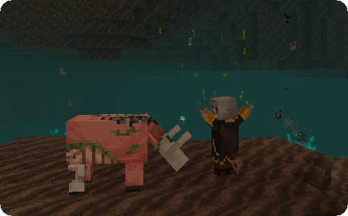
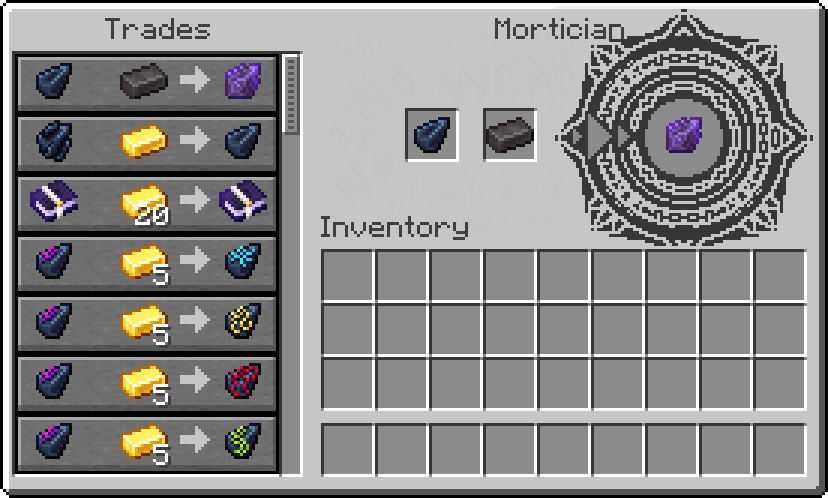
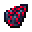
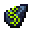
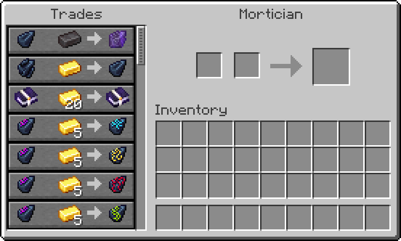

## Mortician

The Mortician is a dead Piglin Trader selling items that are crucial to remnant gameplay such as [Soul Vessels](soul-vessels#empty-soul-vessel). Their prices usually include a **base item** and some **Gold Ingots**, a fee for the processing of the base item. 

By default, Morticians won't attack but once provoked they will **remove souls** from mobs and **curse the player** with [**Penance**](effects#penance) in order to defend themselves.

If you manage to kill a Mortician, it will always drop a **Soul Vessel**.

### Trades

#### Conversion Trade

Using this trade as a mortal player allows you to obtain a [**Sealed Remnant Vessel**](soul-vessels#sealed-remnant-vessel) for **1 Netherite Ingot** and **32 Gold Ingots**, which, upon using, will release the remnant caught inside and change your **Soul Type to remnant**.

Remnants will be able to bring a [**Soul Vessel**](soul-vessels#empty-soul-vessel) as well as a **Netherite Ingot** to the Mortician in order to let it trap their remnant inside the Soul Vessel, **turning them back to a mortal**.

#### Soul Vessel Trade

This trade is essential to Requiem as it allows to **repair [Shattered Soul Vessels](soul-vessels#shattered-soul-vessel)** and use them for possession.

#### Humanity Trade

The Humanity Trade can be used to **upgrade a [Humanity I](possession#loot-mechanics)** book to a level II enchantment for 20 Gold Ingots.

#### Ichor Trades

The Ichor Trades allow trading in [filled Soul Vessels](soul-vessels#filled-soul-vessel) with different Souls for the [4 different Ichors](soul-vessels#ichor-vessels).

A **Villager** Soul can be traded into **Emancipation** in the Overworld, replaced with a **Piglin** Soul in the Nether.

**Reclamation** Ichor requires an **Axolotl** Soul,

**Attrition** uses **Ghast** Souls and

**Penance** Ichor can be bought with **Pillager** Souls.

#### Ethereal Mortician

Morticians spawning due to [Soul Rifts](obelisks#soul-rift) will have a **varied appearance** and be slightly **translucent**.

