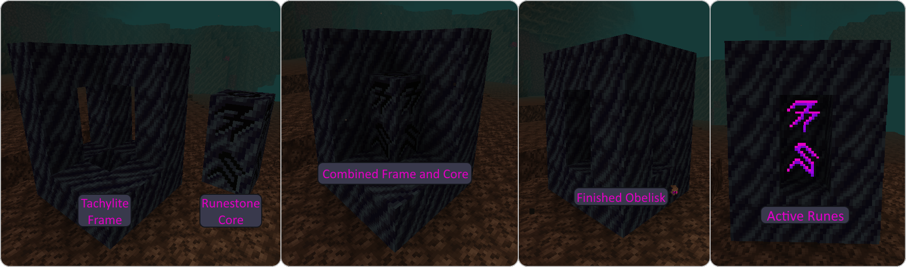
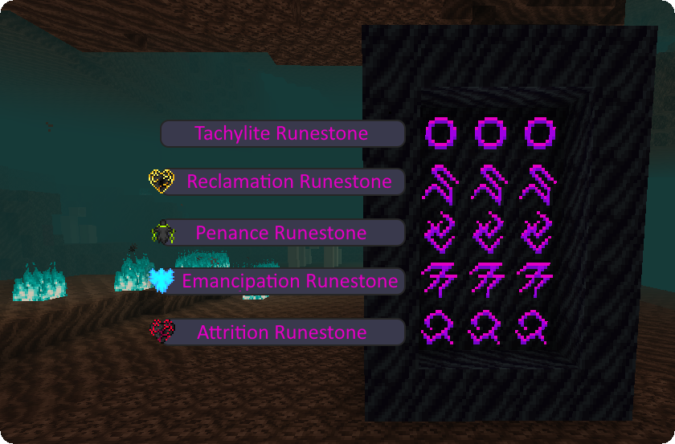
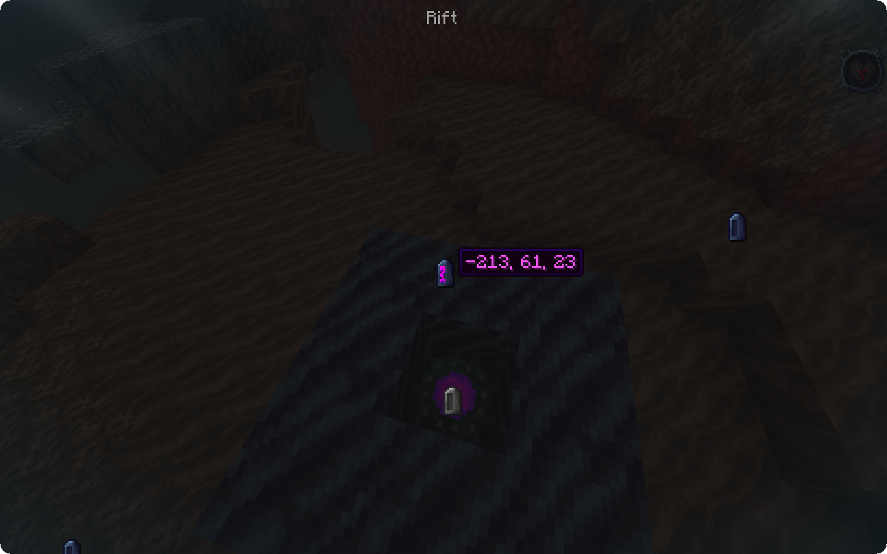
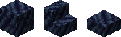
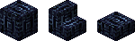
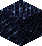
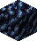
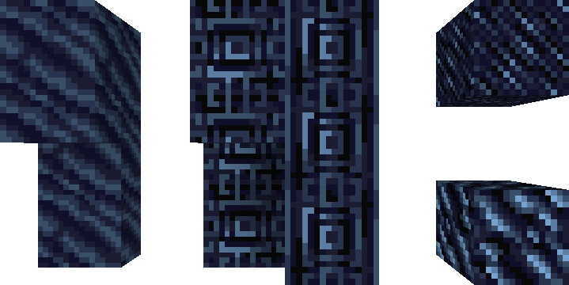
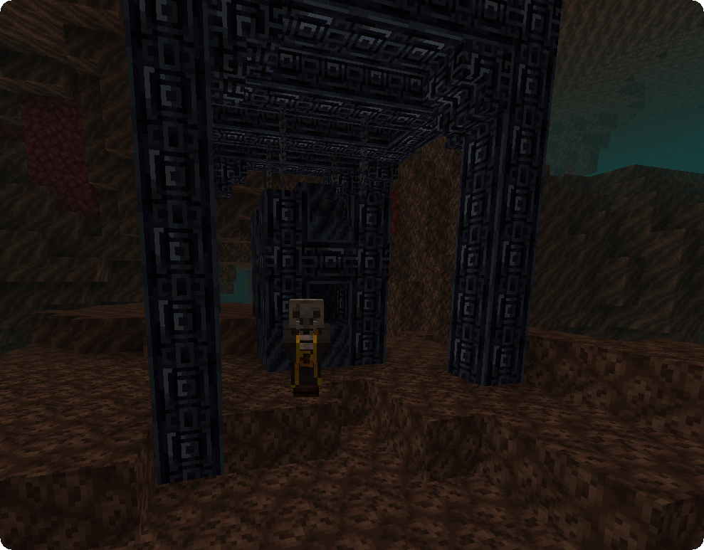

Obelisks are **player-built structures** usually **casting [Soul Effects](effects)** on nearby remnant players.
Their function depends on the **Runestones** used and they absorb the power of the souls trapped in Soul Sand and Soul Soil.

### Structure

The Obelisk's **core** is made of different [**Runestones**](#runestones), having a **maximal width of 5 blocks** and a **maximal height of 20 blocks**.
Each layer of the core must have the same kind of Runestone.

The core is encased in a **frame** of full [**Tachylite blocks**](#tachylite----) as seen in the picture below.

An Obelisk also requires **Soul Sand or Soul Soil** in order to **power** up with **increasing needs as the width of the Obelisk is expanded**.
Soul Sand and Soul Soil must be placed **below** the Obelisk with a clear **line of sight** in between block and structure.
The valid area to place your Soul blocks is a square with the side length `10*width of the core` with the Obelisk in its center.

An Obelisk will affect remnant players in a square shaped area of `10*width+10` blocks radius.

### Runestones

#### Tachylite Runestones

Tachylite Runestones are the **defining factor** of an Obelisk.
The basic Tachylite Runestone can be crafted using 8 Tachylite and 1 Crying Obsidian.

It can then be **imbued using [Ichors](soul-vessels#ichor-vessels)** and will adopt the respective **[Soul Effect](effects)**.
Once they are imbued they will **grant their Soul Effect** to remnant players when included in an Obelisk.

The Ichors can be changed by using dispensers, for example activating a dispenser containing an [empty Soul Vessel](soul-vessels#empty-soul-vessel) and facing a Tachylite Runestone with Attrition will render the Obelisk neutral and fill the Soul Vessel with Ichor.

#### Soul Rift

The Soul Rift can be crafted using 4 Tachylite Runestones, 4 Crying Obisian and 1 Enderpearl.
Once implemented into an Obelisk, it will allow **dissociated remnant players** to **teleport** between different Soul Rifts as long as they **do not have [Attrition IV](effects#attrition)**.
Rifts will also **increase the level of Attrition** upon teleportation.

Active Soul Rifts also have the side effect of attracting [**Ethereal Morticians**](mortician#ethereal-mortician) to roam around their Obelisk.

Once you click the Soul Rift as a dissociated player you will see 3 different symbols:

 This icon is assigned to the Obelisk with the **Soul Rift you clicked**

 **Available teleportation destinations** will be marked with this icon

 The **currently selected destination Obelisk** will display this icon along with the **coordinates** of the corresponding Soul Rift

### Tachylite    

Tachylite is the **base material for Obelisks**. It can be made from 4 Obsidian, 4 Basalt and 1 [Filled Soul Vessel](soul-vessels#filled-soul-vessel) and its durability is halfway between Obsidian and Basalt.

In addition to **Tachylite stairs and slabs**, there are multiple other versions of this block type.

#### Chiseled Tachylite    

Chiseled Tachylite can be crafted by putting 2 Tachylite blocks on top of each other in a crafting grid. Just like normal Tachylite, chiseled Tachylite can be used to **build Obelisks** and has **stair and slab variants** of the block.

There is also a **Chiseled Tachylite Pillar** made by putting 2 Chiseled Tachylite blocks on top of each other.

#### Scraped Tachylite    

Scraped Tachylite can be found as parts of [**derelict Obelisks**](#derelict-obelisks) and can be mined to be used as Obelisk frame and building block.

#### Derelict Tachylite    

Derelict Tachylite can only be found as a part of a [Derelict Obelisk](#derelict-obelisks). Breaking it will grant **large amounts of experience** and has a **20% chance on dropping a [Shattered Soul Vessel](soul-vessels/shattered-soul-vessel)**. The Fortune enchantment increases this chance by 10% per level.

Derelict Tachylite is the only Tachylite variant that can **not** be used as an Obelisk frame block.

### Derelict Obelisks

Derelict Obelisks are **abandoned structures** spawning in **Soul Sand Valleys**. They include [**Derelict Tachylite**](#derelict-tachylite----) and are therefore a source of [**Soul Vessels**](soul-vessels). They also have a 1 in 3 chance to have a [**Mortician**](mortician) roaming the area.

