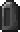

# Obelisks

Obelisks are **player-built structures** usually **casting [Soul Effects](effects)** on nearby remnant players. Their function depends on the **Runestones** used and they absorb the power of the souls trapped in Soul Sand and Soul Soil.

### Structure

The Obelisk's **core** is made of different **Runestones**, having a **maximal width of 5 blocks** and a **maximal height of 20 blocks**. Each layer of the core must have the same kind of Runestone.

The core is encased in a **frame** of full **Tachylite blocks** as seen in the picture below.

An Obelisk also requires **Soul Sand or Soul Soil** in order to **power** up with **increasing needs as the width of the Obelisk is expanded**. Soul Sand and Soul Soil must be placed **below** the Obelisk with a clear **line of sight** in between block and structure. The valid area to place your Soul blocks is a square with the side length `10*width of the core` with the Obelisk in its center.

An Obelisk will effect remnant players in a square shaped area of `10*width+10` blocks radius.

{: .wiki}

{: .wiki}

### Runestones

#### Tachylite Runestones

Tachylite Runestones are the **defining factor** of an Obelisk. The basic Tachylite Runestone can be crafted using 8 Tachylite and 1 Crying Obsidian. It can then be **imbued using [Ichors]()** and will adopt the respective **[Soul Effect]()**. Once they are imbued they can not be changed but will **grant their Soul Effect** to remnant players once included in an Obelisk.

{: .wiki}

#### Soul Rift

The Soul Rift can be crafted using 4 Tachylite Runestones, 4 Crying Obisian and 1 Enderpearl. They will allow **dissociated remnant players** to **teleport** between different Soul Rifts as long as they **do not have Attrition IV**. Rifts will also **increase the level of Attrition** upon teleport.

Active Soul Rifts also have the side effect of attracting **Ethereal Morticians** to roam around their Obelisk.

Once you click the Soul Rift as a dissociated player you will see 3 different symbols:

{: .wiki} This icon is assigned to the Obelisk with the **Soul Rift you clicked**

{: .wiki} **Available teleportation destinations** will be marked with this icon

{: .wiki} The **currently selected destination Obelisk** will display this icon along with the **coordinates** of the corresponding Soul Rift

{: .wiki}

### Tachylite    {: .wiki}

Tachylite is the **base material for Obelisks**. It can be made from 4 Obsidian, 4 Basalt and 1 Filled Soul Vessel and its durability is halfway between Obsidian and Basalt.

In addition to **Tachylite stairs and slabs**, there are multiple other versions of this block type.

#### Chiseled Tachylite    {: .wiki}

Chiseled Tachylite can be crafted by putting 2 Tachylite blocks on top of each other in a crafting grid. Just like normal Tachylite, chiseled Tachylite can be used to **build Obelisks** and has **stair and slab variants** of the block.

There is also a **Chiseled Tachylite Pillar** made by putting 2 Chiseled Tachylite blocks on top of each other.

#### Scraped Tachylite    {: .wiki}

Scraped Tachylite can be found as parts of **derelict Obelisks** and can be mined to be used as Obelisk frame and building block.

#### Derelict Tachylite    {: .wiki}

Derelict Tachylite can only be found as a part of a Derelict Obelisk. Breaking it will grant **large amounts of experience** and has a **20% chance on dropping a [Shattered Soul Vessel](soul-vessels/shattered-soul-vessel)**. The Fortune enchantment increases this chance by 10% per level.

Derelict Tachylite is the only Tachylite variant that can **not** be used as an Obelisk frame block.

{: .wiki}

### Derelict Obelisks

Derelict Obelisks are **abandoned structures** spawning in **Soul Sand Valleys**. They include **Derelict Tachylite** and are therefore a source of [**Soul Vessels**](soul-vessels). They also have a 1 in 3 chance to have a **Mortician** roaming the area.

{: .wiki}

## Mortician

The Mortician is a dead Piglin Trader selling items that are crucial to remnant gameplay such as Soul Vessels. Their prices usually include a **base item** and some **Gold Ingots**, a fee for the processing of the base item. 

By default, Morticians won't attack but once provoked they will **remove souls** from mobs and **curse the player** with [**Penance**](effects#penance) in order to defend themselves.

If you manage to kill a Mortician it will always drop a **Soul Vessel**.

{: .wiki}

### Trades

#### Conversion Trade

Using this trade as a mortal player allows you to obtain a **Sealed Remnant Vessel** for **1 Netherite Ingot** and **32 Gold Ingots**, which, upon using, will release the remnant caught inside and change your **Soul Type to remnant**.

{: .wiki}

Remnants will be able to bring a **Soul Vessel** as well as a **Netherite Ingot** to the Mortician in order to let it trap their remnant inside the Soul Vessel, **turning them back to a mortal**.

{: .wiki}

#### Soul Vessel Trade

This trade is essential to Requiem as it allows to **repair shattered Soul Vessels** and use them for possession.

#### Humanity Trade

The Humanity Trade can be used to **upgrade a [Humanity I]()** book to a level II enchantment for 20 Gold Ingots.

#### Ichor Trades

The Ichor Trades allow to trade in filled Soul Vessels with different Souls for the 4 different Ichors.

{: .wiki}A **Villager** Soul can be traded into **Emancipation** in the Overworld, replaced by a **Pigling** Soul in the Nether.

{: .wiki}**Reclamation** Ichor requires an **Axolotl** Soul,

{: .wiki}**Attrition** uses **Ghast** Souls and

{: .wiki}**Penance** Ichor can be bought with **Pillager** Souls.

{: .wiki}

#### Ethereal Mortician

Morticians spawning due to Soul Rifts will have a **varied appearance** an be slightly **translucent**.

{: .wiki}
