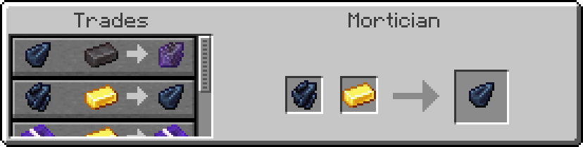
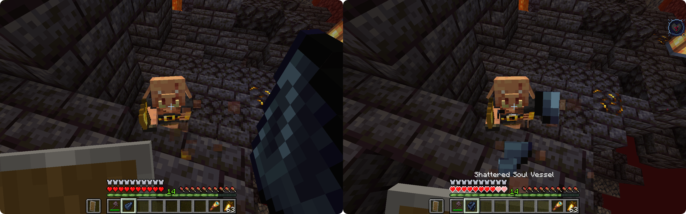
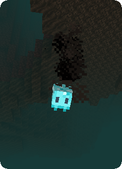
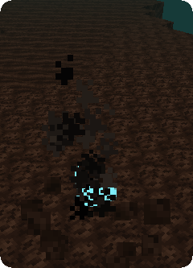
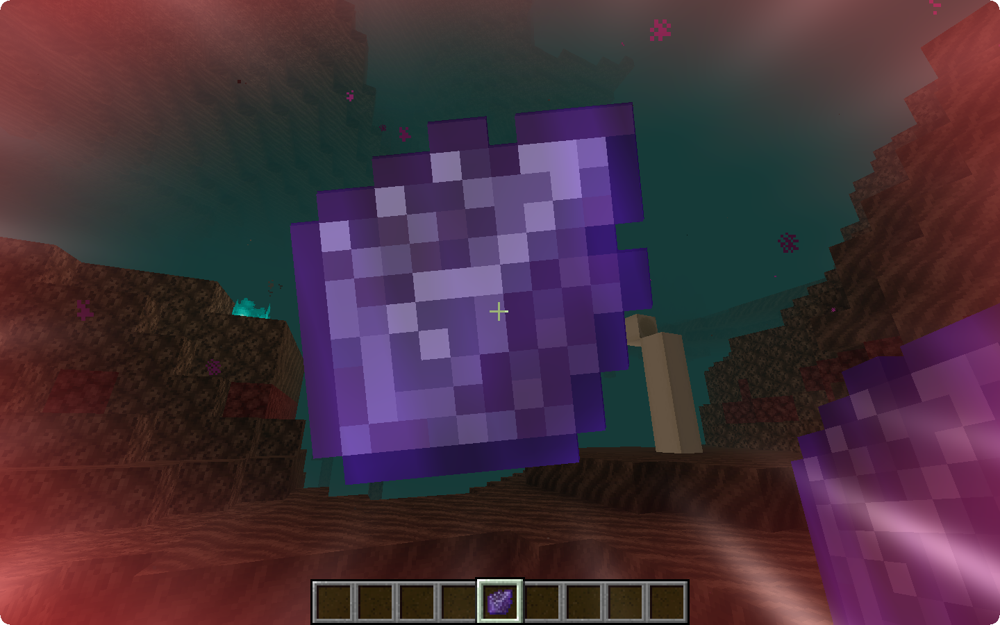

# Soul Vessels

## Shattered Soul Vessel 

Shattered Soul Vessels can be found with a 20% chance (with an additional 10% per fortune level) by mining **[Derelict Tachylite](obelisks#derelict-tachylite)**. Despite not being useful on their own, they can be **repaired by the [Mortician](obelisks#mortician)** for the small fee of a Gold Ingot.

{: .wiki}

## Empty Soul Vessel

Once repaired, Soul Vessels can be used to **remove the soul** of most mobs,
excluding bosses and soulless mobs. Without soul, the mobs will become empty hulls
which can be **possessed by remnant players**.

The process of removing a soul can fail however - in case of which the Soul Vessel shatters and
your level of Attrition increases - and its chance of success depends on the player's level of Attrition,
the target's strength, health, max health, base armor, armor toughness as well as, despite being rare,
innate soul defense.

**You can _not_ start a soul removal if your Attrition level is 4.**

{: .wiki}

### Filled Soul Vessel

Once a Soul Vessel is filled it can either be used for **trading with the Mortician**,
or the Soul **can be released** again, in case of which it will return to the original mob
it was removed from, reviving said mob. If that mob is dead, the Soul will collapse upon release.

{: .wiki}{: .wiki}

### Creative Soul Vessel

The Creative Soul Vessel is a **creative exclusive** version of the Soul Vessel with a **guaranteed success** on the removal of souls.

## Sealed Remnant Vessel

The Sealed Remnant Vessel is an item sold by the [Mortician](obelisks#mortician) which will turn the **player into a remnant** upon usage.

{: .wiki}

## Ichor Vessels

Ichor Vessels can be used similarly to potions, consuming the Ichor and casting a [Soul Effect](effects) on you.

### {: .wiki}Emancipation Vessel

Emancipation Vessels can be bought from the **[Mortician](obelisks#mortician)** for **5 Gold Ingots** and a Soul Vessel with either a **Villager Soul** when in the **Overworld** or a **Piglin Soul** in the **Nether**.

Emancipation Vessels will grant you the **[Emancipation Soul Effect](effects#emancipation)** for **10 minutes** upon usage and will leave you with an **Empty Soul Vessel**.

### {: .wiki}Reclamation Vessel

Reclamation Vessels are available at the **[Mortician](obelisks#mortician)**'s Shop for a Soul Vessel with **Axolotl Soul** and **5 Gold Ingots**.

Reclamation Vessels will grant you the **[Reclamation Soul Effect](effects#reclamation)** for **10 minutes** upon Usage and will leave you with an **Empty Soul Vessel**.

### {: .wiki}Attrition Vessel

Attrition Vessels can be obtained from the **[Mortician](obelisks#mortician)** at the cost of a Soul Vessel containing a **Ghast Soul** and **5 Gold Ingots**.

Attrition Vessels will curse you with the **[Attrition Soul Effect](effects#attrition)** for **10 minutes** upon usage and will leave you with an **Empty Soul Vessel**.

### {: .wiki}Penance Vessel

Penance Vessels can be traded from the **[Mortician](obelisks#mortician)** for a Soul Vessel with a **Pillager Soul** and **5 Gold Ingots**.

Penance Vessels will curse you with the **[Penance Soul Effect](effects#penance)** for **10 minutes** and will leave you with an **Empty Soul Vessel**.
