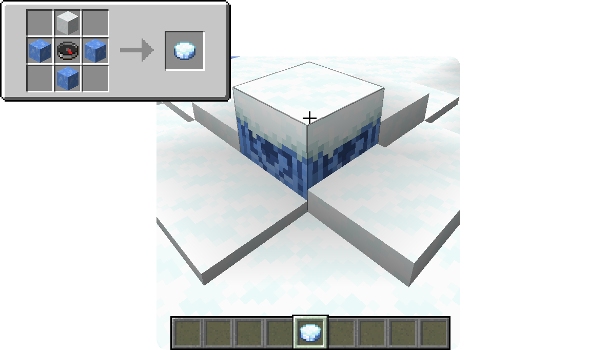
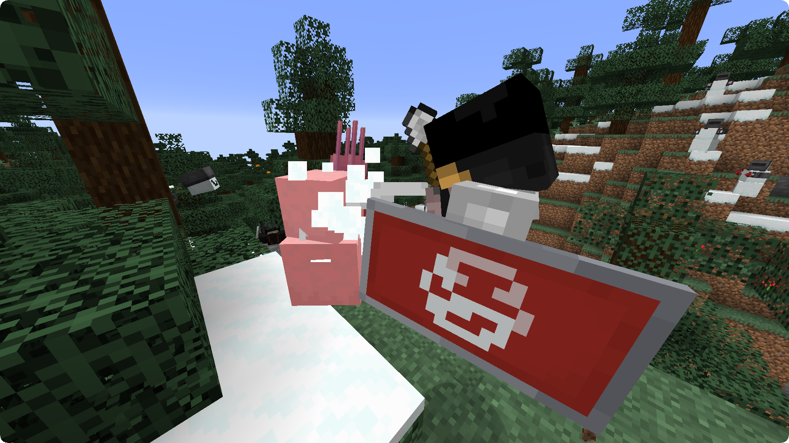

**Snow Mercy** is a Minecraft Fabric mod introducing a new event, the Snow Mercy invasion, in which the player can fight off waves of hostile and heavily modified combat snowmen, as well as new mechanics to fight these snowmen and make them your own.

## Video Showcase

<iframe width="560" height="315" src="https://www.youtube.com/embed/NDRtmo62U4E" frameborder="0" allow="accelerometer; autoplay; clipboard-write; encrypted-media; gyroscope; picture-in-picture" allowfullscreen></iframe>

## Features

### Snow Mercy Invasion

**Snow Mercy** adds an event called the "Snow Mercy Invasion" that can either be triggered by using a Frozen Compass or commands. The Snow Mercy Invasion will spawn different kinds of custom Snowmen that you will have to fight - or run from!

#### Frozen Compass

The Frozen Compass can be used on a Lodestone to turn it into a Frozen Lodestone and start the Snow Mercy Invasion. Breaking the Frozen Lodestone will stop the Invasion as well as dropping the Lodestone.

{: .wiki}

#### Commands

- ``/snowmercy start`` will start a Snow Mercy invasion if one isn't already active.
- ``/snowmercy stop`` will stop a Snow Mercy invasion if one is currently active.

### Snow Mercy Mechanics

Snow Mercy adds a few new mechanics evolving around the Snowmen themselves.

- **Spawning:** Snowmen spawn in large quantities during a Snow Mercy Invasion. However they do not spawn in areas with a light level of 5 or more (note that this only applies to artificial light, Snowmen will still spawn at daytime).

- **Snowman Resistances:** These Snowmen are stronger than the usual ones, they do not take damage in warm biomes or water, including rain, and are able to cross water using frost walker.

- **Decapitation:** Using a shovel to hit Snowmen will have a chance to decapitate them, launching their head away and giving you the opportunity to replace it with a pumpkin to make the Snowman fight for you against evil Snowmen and hostile mobs. The more damage the attack deals, the higher the chance of success and the further the head will fly! Both head and body will die after 30 seconds if the head is not replaced.

  {: .wiki}

  

### Snowman Types

There are 5 different Snowman Types introduced by Snow Mercy:

- **Sawman:** The Sawman is a relatively weak melee unit. Combined with other Snowmen however, this Snowman can still be a serious threat. The Sawman drops 0-1 Iron Nuggets.
- **Mister Snuggles:** Mister Snuggles is a melee unit that will explode when near its target, similar to creepers, but its explosion does not harm entities, instead it launches them up in the air in combination with some snow blocks. The explosion can be triggered remotely by hitting Mister Snuggles with a Snowball. Mister Snuggles has a chance of 20% to drop one TNT.
- **Mister Chill Snuggles:** Mister Chill Snuggles works very similar to Mister Snuggles, with the exception of launching harmful icicles instead of Snow Blocks. Mister Chill Snuggles drops 0-1 Packed Ice and has a chance of 20% to drop one TNT.
- **Ice Mortar:** The Ice Mortar launches large numbers of icicles that will slowly rain down, being especially dangerous when combined with other Snowmen or when appearing in large numbers. The Ice Mortar drops 0-1 Packed Ice.
- **Aftermarket Snowman:** This Snowman features a long cooldown but strong firepower, shooting fireworks from a distance and dealing damage to multiple entities. The Aftermarket Snowman has a 25% chance to drop 1-3 of its firework rockets.

{: .wiki}

## FAQ

#### Can I include this mod in a modpack?

**Yes**: You can. Go ahead, don't bother asking. Please however provide credit and a link to both the GitHub repository and Curse Forge project page.

#### Will you be making a Forge version? Does a Forge version exist?

**No:** I will not be making a Forge version of this mod. The code being GPL3 however, feel free to do a port if you feel like it.

## Gallery

{: .wiki}

{: .wiki}

{: .wiki}

{: .wiki}

{: .wiki}

{: .wiki}
