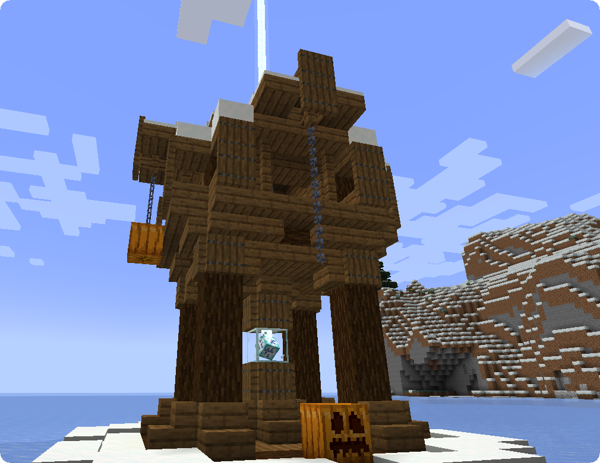
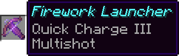
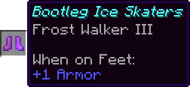
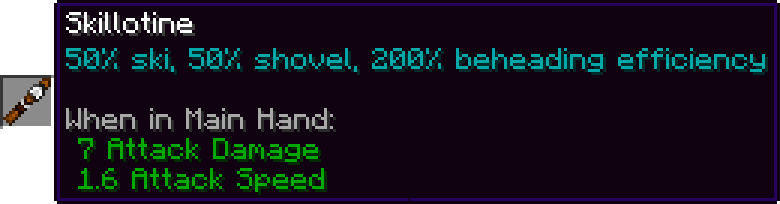
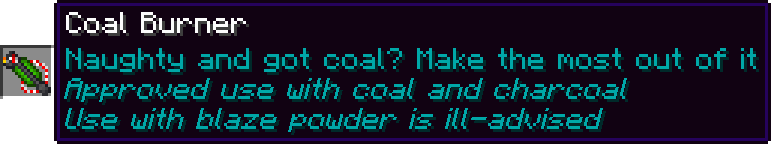
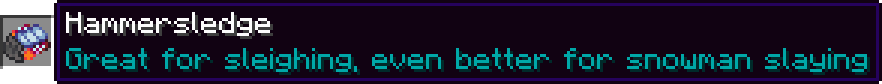
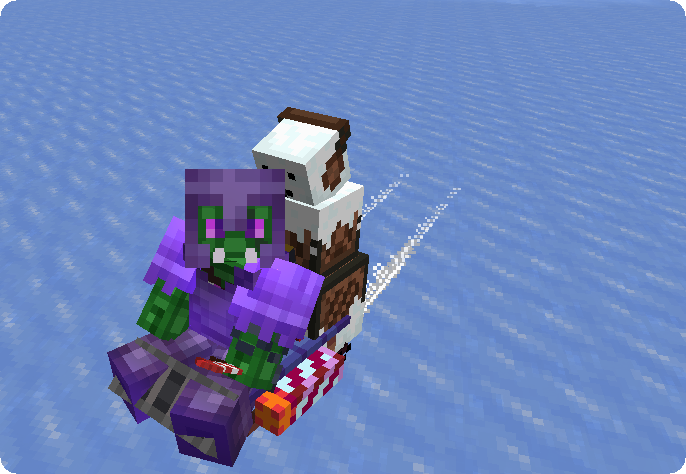
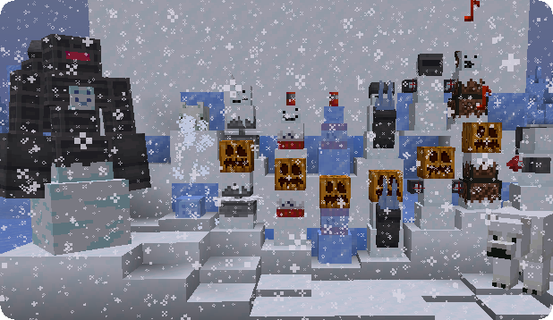

**Snow Mercy** is a Minecraft Fabric mod introducing a new dimension, the Winter Murderland, in which the player can fight off waves of hostile and heavily modified combat snowmen, as well as new mechanics to fight these snowmen and make them your own.

## Video Showcase

<iframe width="560" height="315" src="https://www.youtube.com/embed/NDRtmo62U4E" frameborder="0" allow="accelerometer; autoplay; clipboard-write; encrypted-media; gyroscope; picture-in-picture" allowfullscreen></iframe>

<iframe width="560" height="315" src="https://www.youtube.com/embed/luIcz_bOBDA" frameborder="0" allow="accelerometer; autoplay; clipboard-write; encrypted-media; gyroscope; picture-in-picture" allowfullscreen></iframe>

## Winter Murderland

The Winter Murderland is a new dimension being **purely composed of the different snowy and icy biomes** as well as large ice plains. It can be entered by placing down **3 Powdered Snow blocks on top of each other, surrounding them with 24 Blue Ice blocks** and sinking into the Powdered Snow in the middle. Along with some overworld structures like villages and pillager outposts the Winter Murderland features commonly found Iceposts:

### Iceposts

These small towers spawn in the Winter Murderland, contain a Heart of Ice within a glass block and project a white beacon beam. Breaking the glass and **hitting the Heart will start a wave** and the beam will start blinking red. After the wave is defeated the Heart of Ice will be replaced by a **frozen Lodestone, bringing the player back to the overworld** once being clicked, and the beam will shut down.

### Waves

Snow Mercy offers 10 uniquely composed waves of snowmen, initiated by hitting the Heart of Ice at an Icepost. After each wave, the player will receive an amount of airdropped gifts proportionate to the wave count. For example, after completing wave 1, the player will receive 1 gift, 2 gifts after wave 2...

These gifts contain various drops like **valuables** (coal, iron, gold, emeralds, diamonds), **food** (cookies, cakes, stews) or **spawn eggs for pets** (parrots, wolves, cats, rabbits). There is also a chance to get 1 out of 5 special items:

- A crossbow called "Firework Launcher" enchanted with Quick Charge 3 and Multishot 

   

  

- Leather Boots called "Bootleg Ice Skaters" enchanted with Frost Walker 3

   

  

- **The Skillotine**, a new item combining the attack speed of a Sword and the functions of a Shovel, being able to behead Snowmen and collect snow.

   

  

- **The Coal Burner** uses Coal or Charcoal to melt Powdered Snow, Ice and entities in front of it. Alternatively, Blaze Powder can be used as fuel, making the flames strong enough to melt Packed Ice, Blue Ice and Snow as well as spreading flames.

   

- **The Hammersledge**, a ridable sledge with firework rockets moving quickly on snow and ice, both up- and downhill, ramming entities for damage and destroying Powdered Snow in its path. Just like with boats, 2 players can ride a Hammersledge together.

  

### Custom Mechanics

- **Snowman Resistances:** These Snowmen are stronger than the usual ones, they do not take damage in warm biomes, powder snow or water, including rain, and are able to cross water using frost walker.

- **Head Drop:** Killing a Snowman will always drop its head. The heads can be destroyed by hitting them and will despawn after 30 seconds.

- **Decapitation:** Using a shovel to hit Snowmen will decapitate them, launching their head away and giving you the opportunity to replace it with a pumpkin to make the Snowman fight for you against evil Snowmen and hostile mobs. The more damage the attack deals the further the head will fly! A beheaded Snowman will attack everything in range for 30 seconds, after which both body and head will despawn.

  

  

## Enemy Types

There are 10 different Snowman Types introduced by Snow Mercy:

- **Tundrabid:** Aggressive Snow Foxes, recognizable by the foam on their mouth.

- **Iceball:** These Frozen Slimes will jump high into the air near the player, bursting into dozens of deadly icicles dealing freezing damage upon hitting the ground again.

- **Sawman:** The Sawman is a relatively weak melee unit. Combined with other snowmen however, this foe can still be a serious threat. The Sawman drops 0-1 Iron Nuggets.

- **Mister Snuggles:** Mister Snuggles is a melee unit that will explode when near its target, similar to creepers, but its explosion does not harm entities and blocks, instead launching them up in the air in combination with some Powdered Snow blocks.  Mister Snuggles has a chance of 20% to drop one TNT.

- **Mister Chill Snuggles:** Mister Chill Snuggles works very similar to Mister Snuggles, with the exception of launching harmful icicles instead of Powdered Snow blocks. Mister Chill Snuggles drops 0-1 Packed Ice and has a chance of 20% to drop one TNT.

- **Ice Mortar:** The Ice Mortar launches large numbers of icicles into the air that will slowly rain down, being especially dangerous when combined with other snowmen or when appearing in large numbers. The Ice Mortar drops 0-1 Packed Ice.

- **Aftermarket Snowman:** This snowman features a long cooldown but strong firepower, shooting fireworks from a distance and dealing damage to multiple entities. The Aftermarket Snowman drops 1-3 of its firework rockets.

- **Polar Bearer:** An Aftermarket Snowman riding an aggressive Polar Bear.

- **Iceboombox:** Iceboomboxes do not attack players but instead follow them around playing christmas music on their jukeboxes!

- **Headmaster:** This giant snowman and deadly **miniboss** has 200hp and 2 phases: 

  In the first phase, it will **launch heads** from its back and **cast resurrection spells** giving all beheaded snowmen in the area a new body. In this phase it is also not able to deal any direct damage and will follow the player around without attacking itself.

  Once the Headmaster lost 2/3 health it will turn into a mobile snow canon, freezing all entities in front of it.

<h2 id="wave-configuration">Wave Configuration (Spoilers)</h2>


- **Wave 1:** Sawman, Tundrabid, Iceball
- **Wave 2:** Sawman, Tundrabid, Aftermarket Snowman, Ice Mortar
- **Wave 3:** Sawman, Tundrabid, Aftermarket Snowman, Mister Snuggles, Iceboombox, Iceball
- **Wave 4:** Sawman, Ice Mortar, Aftermarket Snowman, Mister Snuggles, Iceboombox
- **Wave 5:** Headmaster
- **Wave 6:** Sawman, Aftermarket Snowman, Ice Mortar, Mister Snuggles, Mister Chill Snuggles, Iceball
- **Wave 7:** All enemies except Iceboombox
- **Wave 8:** Mister Chill Snuggles, Iceball
- **Wave 9:** Sawman, Headmaster, Mister Snuggles
- **Wave 10:** All enemies




## FAQ

#### Can I include this mod in a modpack?

**Yes**: You can. Go ahead, don't bother asking. Please however provide credit and a link to both the GitHub repository and Curse Forge project page.

#### Will you be making a Forge version? Does a Forge version exist?

**No:** I will not be making a Forge version of this mod. The code being GPL3 however, feel free to do a port if you feel like it.

## Gallery

