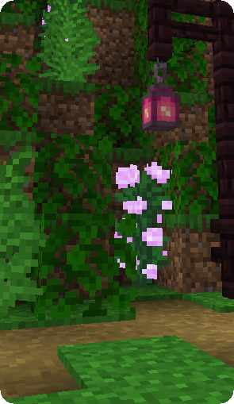
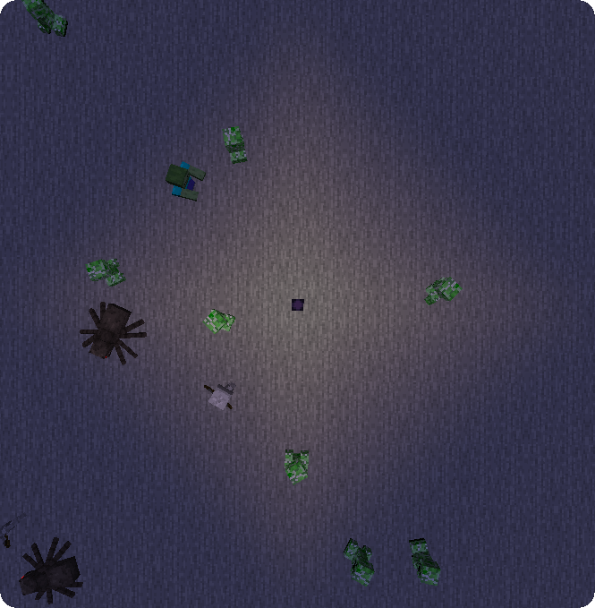

**Spawn Lanterns** is a Minecraft Fabric mod that introduces a solution for regulating hostile mob spawn rates.

## Lantern conversion

Soul lanterns can be converted into spawn lanterns depending on the ingredient used.

### Soothing Lantern

Using a honey bottle on a soul lantern will transform it into a Soothing lantern (along with giving you back an empty bottle).
Soothing lanterns grant the Soothing effect in a 20x20x20 block radius around the lantern. 

{: .wiki}

#### Soothing

Soothing avoids hostile mob spawns if the light level is above 0, meaning mobs won't spawn on the surface, even during the night.
However, Soothing doesn't decrease the mob spawn cap, meaning you may find more mobs in caves during nighttime.

{: .wiki}

{: .wiki}

### Crying Lantern

Using a crying obsidian block on a soul lantern will transform it into a Crying lantern (along with giving you back an obsidian block).
Crying lanterns grant the Provocation effect in a 20x20x20 block radius around the lantern. 

{: .wiki}

#### Provocation

Provocation multiplies the mob spawn limit by two, meaning more hostiles will be present at the same moment.
Provocation also makes neutral mobs (wolves, bears...) and neutral-hostile mobs (endermen, zombified piglins...) target you automatically.

{: .wiki}

{: .wiki}